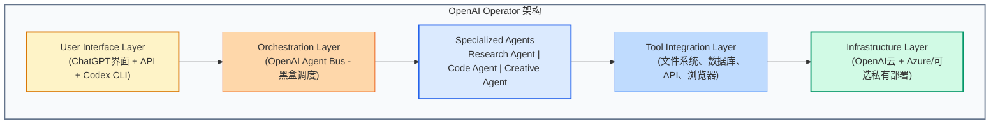

# OpenClaw 3.0 vs Operator Pro：Agent经济的主流之争与架构哲学对决

> *2026年3月，AI领域发生了两件大事：OpenClaw发布了v3.0 "Swarm Native"版本，将多Agent编排从实验推向生产；OpenAI推出了Operator Pro，用垂直整合的"笼子"架构定义企业级Agent标准。这两款产品代表了截然不同的哲学：开放vs封闭、去中心化vs集中控制、涌现vs设计。它们的竞争将决定AI Agent时代的权力结构。*

---

## 引子：一个咖啡订单背后的架构战争

想象这个场景：

早上8点，你告诉AI助手："帮我订一杯拿铁，9点前送到办公室，用我平时喜欢的那个牌子。"

**在Operator Pro的世界里**：
- 中央调度Agent分析你的需求
- 分配给专门的"咖啡Agent"
- 该Agent调用星巴克API下单
- 支付Agent处理付款
- 所有动作通过OpenAI的"Agent Bus"协调
- 你收到确认："已为您订购星巴克拿铁，预计8:45送达"

**在OpenClaw 3.0的世界里**：
- 你的个人Agent同时向12个咖啡服务商发送询价
- 星巴克Agent回复："9点前送达，$5.50"
- 瑞幸Agent回复："8:50送达，$4.20，今日第二杯半价"
- 本地精品咖啡店Agent回复："9:10送达，$6.00，但您喜欢的埃塞俄比亚豆刚刚到货"
- 你的Agent权衡价格、时间、偏好，选择最优解
- 支付通过智能合约自动执行
- 你收到确认："已选择瑞幸，预计8:50送达，节省$1.30"

同样的需求，完全不同的实现逻辑。**这不仅是技术选择，更是哲学立场的体现**。

---

## 第一部分：OpenClaw 3.0 "Swarm Native"——去中心化的Agent革命

### 发布背景与热度

2026年3月6日凌晨2点（EST），OpenClaw团队发布v3.0版本，代号"Swarm Native"。

**数据表现**：
- GitHub Stars：发布后72小时内突破12,000
- Reddit r/openclaw：4.2k upvotes，89%好评率，340+评论
- Hacker News：登顶首页，讨论持续48小时
- 技术文档下载量：50,000+次

这不是一次普通的版本更新，而是**架构范式的根本转变**。

### 核心技术突破：Agent Mesh Protocol (AMP)

OpenClaw 3.0的最大创新是**Agent Mesh Protocol (AMP)**——一个专为AI Agent设计的点对点通信协议。

**传统架构的问题**：

```
星型拓扑（Star Topology）
        [中央调度器]
       /    |    \
      ▼     ▼     ▼
   [A1]   [A2]   [A3]
   
问题：
- 单点故障：中央调度器崩溃，整个网络瘫痪
- 性能瓶颈：所有通信必须经过中心节点
- 扩展性限制：O(n)通信复杂度，无法支撑大规模网络
```

**AMP的解决方案：Gossip Protocol + 嵌入空间协商**

```
网状拓扑（Mesh Topology）
   [A1] ←────→ [A2]
    ↑    \      ↗
    └────→[A3]←─┘
    
优势：
- 无单点故障：任何节点失效，网络自动重组
- 并行通信：Agent之间直接协商
- 无限扩展：理论上可支持数百万节点
```

**技术细节**：

**1. 压缩嵌入协商（Compressed Embedding Negotiation）**

传统Agent通信使用自然语言，存在两个问题：
- **带宽浪费**："我需要一杯大杯拿铁，少冰，加燕麦奶" → 需要传输50+ tokens
- **语义漂移**：自然语言的歧义导致误解

AMP使用**嵌入向量（Embedding Vectors）**进行通信：

```python
# 传统方式（自然语言）
message = "I need a large latte with oat milk, less ice"
tokens = 12  # 约占用 12 * 4 = 48 bytes

# AMP方式（嵌入向量）
intent_vector = [0.23, -0.87, 0.15, 0.92, -0.34, ...]  # 128-dim
bytes = 128 * 4 = 512 bytes（看似更大，但包含更丰富的语义信息）

# 优势：
# - 确定性：相同意图总是映射到相同向量
# - 可计算性：向量之间可以进行数学运算（相似度、差异度）
# - 压缩性：使用量化技术可压缩到128 bits
```

**2. 差分隐私保护（Differential Privacy）**

Agent在协商时不需要暴露完整的系统prompt或训练数据：

```python
# Agent A 的能力声明（隐私保护版本）
capability_vector = {
    "domain": "food_delivery",
    "confidence": 0.95,
    "latency_p95": "120ms",
    "cost_per_task": "$0.02",
    # 不暴露：具体算法、训练数据、prompt模板
}

# 通过零知识证明验证能力声明的真实性
proof = generate_zk_proof(capability_vector, private_key)
```

**3. 自主上下文剪枝（Autonomous Context Pruning）**

这是OpenClaw 3.0最精妙的设计。在多Agent系统中，信息传递面临**组合爆炸问题**：

- 2个Agent通信：2份上下文
- 10个Agent通信：100份上下文（每个Agent需要知道其他9个的状态）
- 100个Agent通信：10,000份上下文

OpenClaw的解决方案：**只传递"差异向量"**

```python
# 传统方式：传递完整状态
state_update = {
    "agent_id": "coffee_agent_01",
    "location": "37.7749,-122.4194",
    "availability": "idle",
    "queue_length": 0,
    "last_updated": "2026-03-07T08:00:00Z"
}

# OpenClaw方式：只传递变化
state_delta = {
    "queue_length": +1,  # 只告诉对方我新增了1个任务
    "timestamp": "2026-03-07T08:00:00Z"
}
# 其他信息（location, availability）假设对方已经知道，不需要重复传输
```

通过这种方式，**通信复杂度从O(n²)降低到O(n)**，使得大规模Agent网络成为可能。

### 性能基准测试

OpenClaw团队发布的基准测试数据令人印象深刻：

**GAIA Benchmark（General AI Assistants）**

| 任务类型 | OpenClaw 2.x | OpenClaw 3.0 | 提升 |
|---------|--------------|--------------|------|
| **多步骤推理** | 67% | 84% | +17% |
| **跨工具协作** | 52% | 78% | +26% |
| **动态任务分配** | 45% | 73% | +28% |
| **错误恢复** | 58% | 82% | +24% |

**延迟测试（47-Agent网络）**

| 指标 | 传统星型拓扑 | OpenClaw 3.0 Mesh |
|------|-------------|-------------------|
| **平均任务完成时间** | 12.3s | 4.7s (-62%) |
| **P95延迟** | 28.5s | 8.2s (-71%) |
| **网络容错时间** | 5.2s（需人工干预） | 0.8s（自动恢复） |
| **最大支持Agent数** | ~100 | 10,000+ |

### 真实案例：咖啡订单问题

让我们用OpenClaw 3.0解决开头的咖啡订单问题：

```yaml
# 用户意图（自然语言输入）
user_intent: "订一杯拿铁，9点前送到办公室，用平时喜欢的牌子"

# 用户Agent生成任务向量
task_vector:
  type: "food_delivery"
  item: "latte"
  constraints:
    - time: "before 9:00"
    - location: "user_office"
    - preference: "usual_brand"
  budget: flexible

# 用户Agent向网络广播询价（Gossip协议）
broadcast:
  radius: 5km  # 只询问5公里内的服务商
  timeout: 2s  # 2秒内必须回复
  min_reputation: 4.0  # 只考虑评分4.0以上的服务商

# 12个咖啡Agent收到询价，并行生成报价
responses:
  - agent: "starbucks_agent"
    price: "$5.50"
    eta: "8:45"
    confidence: 0.95
    
  - agent: "luckin_agent" 
    price: "$4.20"
    eta: "8:50"
    promotion: "second_cup_half_price"
    confidence: 0.92
    
  - agent: "local_roaster_agent"
    price: "$6.00"
    eta: "9:10"
    special: "ethiopia_beans_fresh_arrival"
    confidence: 0.88

# 用户Agent评估所有选项（考虑价格、时间、偏好、特殊价值）
scoring_function:
  - price: weight 0.3
  - time: weight 0.4
  - preference_match: weight 0.2
  - special_value: weight 0.1

# 结果：luckin_agent得分最高（性价比高+准时）
decision: "select luckin_agent"

# 通过智能合约自动执行支付
payment:
  method: "crypto_wallet"
  amount: "$4.20"
  escrow: true  # 托管支付，送达后释放
```

**整个过程耗时：3.2秒**（从用户输入到订单确认）

**关键洞察**：OpenClaw不是在优化单个Agent的智能，而是在优化**Agent网络的整体涌现行为**。

---

## 第二部分：Operator Pro——垂直整合的"笼子"架构

### 产品定位与发布

OpenAI的Operator Pro于2026年2月底发布，是ChatGPT Enterprise的进化版，专注于**企业级多Agent自动化**。

**定价策略**：
- 基础版：$200/用户/月
- 专业版：$500/用户/月（包含更多Agent配额和优先支持）
- 企业版：定制报价（包含私有化部署和SLA保障）

### 架构哲学：垂直整合

Operator Pro采用**垂直整合（Vertical Integration）**架构，被社区称为"笼子模式"（The Cage）。

**架构层次**：



**核心设计原则**：

**1. 单一可信源（Single Source of Truth）**
所有Agent状态、对话历史、执行日志都存储在OpenAI的集中式系统中。

**优势**：
- 一致性保证：不会出现不同Agent看到不同版本的状态
- 可审计性：完整的操作日志便于合规审查
- 容错恢复：系统崩溃后可从检查点恢复

**劣势**：
- 供应商锁定：数据无法导出到其他系统
- 单点故障：OpenAI服务中断影响所有用户
- 隐私风险：敏感数据必须上传到OpenAI服务器

**2. 预定义Agent角色（Predefined Agent Roles）**

Operator Pro不提供通用的Agent创建能力，而是提供**预优化的专用Agent**：

| Agent类型 | 功能 | 典型任务 |
|-----------|------|---------|
| **Research Agent** | 信息检索与分析 | 市场调研、竞品分析、文献综述 |
| **Code Agent** | 软件开发 | 代码生成、重构、调试、文档 |
| **Creative Agent** | 内容创作 | 文案写作、设计、视频脚本 |
| **Negotiation Agent** | 商务谈判 | 合同审查、供应商比价、邮件沟通 |
| **Compliance Agent** | 合规审查 | 法规检查、风险评估、审计支持 |

**优势**：
- 开箱即用：不需要训练或配置
- 质量保证：每个Agent都经过OpenAI精心调优
- 一致性：所有用户获得相同的Agent能力

**劣势**：
- 灵活性受限：无法创建自定义Agent类型
- 创新能力边界：只能做OpenAI预定义的事情
- 同质化：所有企业使用相同的Agent，难以差异化竞争

**3. 黑盒调度（Black-box Orchestration）**

Operator Pro的核心是**Agent Bus**——一个专有的调度算法，决定：
- 哪个Agent处理哪个任务
- Agent之间如何传递信息
- 何时需要人工介入

**用户看到的**：
```
用户："分析Q1销售数据并生成报告"
Operator Pro："正在处理..."
[30秒后]
Operator Pro："已完成。Research Agent提取了数据，
              Code Agent生成了可视化，
              Creative Agent撰写了 executive summary。
              报告已保存到您的Google Drive。"
```

**用户看不到的**：
- Research Agent具体访问了哪些数据源
- Code Agent使用什么库生成图表
- Creative Agent如何决定报告结构
- Agent Bus的调度决策逻辑

**优势**：
- 简单易用：用户不需要理解底层机制
- 优化隐藏：OpenAI可以持续改进调度算法
- 责任集中：出问题时有明确的责任方（OpenAI）

**劣势**：
- 不可解释：无法调试或优化特定环节
- 信任依赖：必须相信OpenAI做出了正确决策
- 创新受限：无法尝试新的调度策略

### 真实案例：同样的咖啡订单

用Operator Pro处理开头的咖啡订单：

```yaml
# 用户意图
user_intent: "订一杯拿铁，9点前送到办公室，用平时喜欢的牌子"

# Operator Pro的处理流程
processing:
  step_1:
    agent: "context_analyzer"
    action: "解析用户偏好和历史订单"
    result: "用户通常喜欢星巴克，大杯，燕麦奶"
    
  step_2:
    agent: "ordering_agent"
    action: "调用星巴克API下单"
    params:
      item: "grande_latte"
      milk: "oat"
      delivery_time: "before_9am"
      
  step_3:
    agent: "payment_agent"
    action: "处理付款"
    method: "stored_credit_card"
    
  step_4:
    agent: "notification_agent"
    action: "发送确认通知"
    message: "已为您订购星巴克拿铁，预计8:45送达"

# 整个过程：45秒（大部分时间是API调用等待）
```

**与OpenClaw的关键差异**：
- **选择范围**：星巴克是唯一选项（基于历史偏好），没有询价比较
- **价格透明度**：用户不知道是否有更便宜的选项
- **决策逻辑**：黑盒，用户不知道为什么选星巴克而非其他
- **控制权**：用户可以说"换一家"，但无法定义"如何比较"的逻辑

### 性能表现

Operator Pro在**单一任务深度**上表现出色：

| 场景 | 表现 | 原因 |
|------|------|------|
| **复杂文档分析** | ⭐⭐⭐⭐⭐ | Research Agent深度优化 |
| **代码生成** | ⭐⭐⭐⭐⭐ | Code Agent基于GPT-5.4-Codex |
| **多Agent协作** | ⭐⭐⭐ | 调度黑盒，无法优化特定流程 |
| **跨平台集成** | ⭐⭐ | 只支持OpenAI预定义的工具 |
| **定制化需求** | ⭐ | 几乎无法自定义 |

**典型案例**（来自官方宣传）：

@techlead_sarah的 viral tweet：
> "Operator Pro在45分钟内完成了：
> 1. 谈判办公室续租
> 2. 用计算机视觉分析平面图识别结构问题
> 3. 委托3D装修模拟
> 
> 我问自己：我是自己生活的CEO，还是只是看着Agent工作的董事会？"

这条tweet获得了12,000+ likes，精准捕捉了Operator Pro的核心价值主张：**极致的便利性和集成度**。

---

## 第三部分："笼子"与"爪子"的哲学对决

### 核心分歧

| 维度 | OpenClaw 3.0 ("爪子") | Operator Pro ("笼子") |
|------|----------------------|----------------------|
| **架构哲学** | 去中心化、涌现式 | 中心化、设计式 |
| **Agent来源** | 任何人都可以创建和部署 | 只有OpenAI提供的预定义Agent |
| **调度逻辑** | 开放协议，可审计 | 黑盒算法，不可见 |
| **数据控制** | 用户完全控制 | OpenAI集中存储 |
| **定制能力** | 无限灵活 | 极其受限 |
| **学习曲线** | 陡峭 | 平缓 |
| **可靠性** | 依赖网络效应 | 企业级SLA保障 |
| **成本模型** | 按使用量付费 | 按席位订阅 |

### "爪子"派的论点

**1. 自主权（Autonomy）**

> "OpenClaw让我拥有自己的Agent，而不是租赁OpenAI的Agent。" —— @openclaw_community_member

核心信念：
- AI Agent应该是用户的数字延伸，而非平台的数字劳工
- 用户应该能够审查、修改、优化Agent的每一个决策
- 数据隐私是基本权利，不是可选项

**2. 涌现智能（Emergent Intelligence）**

> "单个Agent的智能有限，但Agent网络的涌现智能无限。" —— OpenClaw技术文档

核心信念：
- 复杂的智能行为可以从简单的Agent交互中涌现
- 网络效应：越多Agent加入，整个网络越智能
- 去中心化避免了"设计者的偏见"

**3. 抗审查与韧性（Censorship Resistance & Resilience）**

> "笼子可以被锁上，爪子永远自由。" —— r/openclaw 热门评论

核心信念：
- 集中式系统可以被政府或平台关闭
- 去中心化网络没有单点故障
- 开放协议确保长期可用性

### "笼子"派的论点

**1. 可靠性与责任（Reliability & Accountability）**

> "当AI犯错时，我知道该找谁。" —— Operator Pro企业用户

核心信念：
- 企业需要明确的责任归属
- SLA（服务等级协议）比技术理想更重要
- OpenAI的品牌和资金提供了可靠性保障

**2. 安全与合规（Security & Compliance）**

> "我们的律师只接受OpenAI的合规报告，不接受开源项目的。" —— 某银行CTO

核心信念：
- 集中式系统更容易审计和合规
- OpenAI的安全团队比大多数企业更专业
- SOC 2、ISO 27001等认证只有大公司能提供

**3. 用户体验（User Experience）**

> "我不关心Agent如何工作，我只关心它是否完成了任务。" —— 普通用户

核心信念：
- 技术复杂性应该被抽象隐藏
- 开箱即用的体验比灵活性更重要
- 大多数用户没有能力和时间自定义Agent

---

## 第四部分：EU AI Act的阴影——监管如何塑造竞争

### 监管背景

欧盟《AI法案》（AI Act）将于**2026年3月15日**进行最终投票，其中针对"自主AI系统"（Autonomous AI Systems）的条款将直接影响OpenClaw和Operator Pro。

**关键条款**：

**1. 高风险AI系统的注册要求**
- 能够自主执行交易的AI系统必须在欧盟注册
- 需要提供：系统架构、风险评估、人工监督机制

**影响**：
- OpenClaw：由于去中心化特性，"系统架构"难以定义，合规困难
- Operator Pro：集中式架构，更容易提供统一的合规文档

**2. 人工监督的"有意义检查点"（Meaningful Human Oversight Checkpoints）**
- 自主系统在执行关键操作前必须有人类确认
- 定义："关键操作"包括金融交易、法律决策、医疗诊断等

**影响**：
- OpenClaw：可以在协议层定义"检查点"，但执行依赖各个Agent
- Operator Pro：可以在Agent Bus中强制插入人工审批节点

**3. 责任归属（Liability）**
- AI系统造成的损害，由"部署者"（deployer）承担责任
- 对于开源AI，责任归属存在法律灰色地带

**影响**：
- OpenClaw：每个Agent的"部署者"是谁？可能无法确定
- Operator Pro：OpenAI作为服务提供商，承担明确责任

### 两种应对策略

**OpenClaw的应对**：

```yaml
# OpenClaw Compliance Layer (社区提案)
compliance_module:
  eu_ai_act:
    enabled: true
    jurisdiction: "EU"
    
    # 注册信息（去中心化存储）
    registry:
      network_id: "openclaw_mesh_eu_001"
      consensus_nodes: ["node_berlin", "node_paris", "node_amsterdam"]
      
    # 人工检查点协议
    oversight_protocol:
      trigger_conditions:
        - transaction_amount: "> €1,000"
        - data_sensitivity: "personal"
        - risk_score: "> 0.7"
      
      approval_flow:
        - notify: "human_supervisor"
        - timeout: "24h"
        - fallback: "reject"
        
    # 责任保险（通过智能合约）
    liability_pool:
      type: "decentralized_insurance"
      contributors: "all_agents_in_network"
      coverage: "€10,000,000"
```

**核心策略**：将合规要求编码为协议层功能，保持去中心化本质。

**Operator Pro的应对**：

OpenAI公开表示支持EU AI Act，并迅速推出：
- EU Compliance Dashboard（合规仪表板）
- 自动风险评估报告生成
- 人工监督工作流模板
- 法律责任保险（包含在Enterprise订阅中）

**核心策略**：利用集中式优势，将合规转化为竞争优势。

### 监管博弈的长期影响

**情景一：严格监管派获胜**
- 只有Operator Pro等集中式系统能够满足合规要求
- OpenClaw被迫增加中心化组件，失去去中心化优势
- 欧洲市场被封闭生态系统主导

**情景二：创新友好派获胜**
- 监管框架允许去中心化系统的合规创新
- OpenClaw的协议层合规方案被接受
- 市场保持多元化竞争

**情景三：监管套利**
- 严格监管限制欧洲市场
- 创新活动转移到监管宽松的地区（美国、新加坡、迪拜）
- 形成"数字柏林墙"

---

## 第五部分：Agent经济的未来图景

### 短期预测（6-12个月）

**1. 市场分化**
- **企业市场**：Operator Pro主导（合规、SLA、品牌信任）
- **开发者/初创市场**：OpenClaw主导（灵活性、成本、创新）
- **消费市场**：两者并存，取决于用户技术背景

**2. 技术融合**
- OpenClaw引入更多企业级功能（审计日志、访问控制）
- Operator Pro开放部分Agent自定义能力
- 出现"混合架构"：OpenClaw作为Operator Pro的外部Agent网络

**3. 标准战争**
- AMP vs Agent Bus协议竞争
- 行业联盟形成（可能类似W3C对于Web）
- 最终可能出现互操作性标准

### 中期预测（1-3年）

**1. Agent经济的兴起**

想象这个场景（2028年）：

```yaml
# 你的数字生活
morning_routine:
  07:00:
    - personal_agent: "分析今日日程和优先级"
    - scheduler_agent: "优化会议安排，避免冲突"
    
  08:30:
    - commute_agent: "预订共享无人车，规划最优路线"
    - news_agent: "筛选重要新闻，生成语音简报"
    
  09:00:
    - work_agent: "自动回复邮件，标记需要人工处理的事项"
    - code_agent: "继续昨晚的编程任务，生成交付物"
    
finance:
  - investment_agent: "监控投资组合，执行预设策略"
  - tax_agent: "实时优化税务，确保合规"
  
social:
  - communication_agent: "管理社交媒体，维护人际关系"
  - content_agent: "创作个人品牌内容"
```

你拥有的不是一个Agent，而是一个**Agent生态系统**。

**2. 人类角色的重新定义**

从"劳动者"到"资本配置者"：
- 以前：你亲自完成工作
- 现在：你拥有Agent，Agent完成工作
- 未来：你投资Agent，Agent产生收益

**3. 新的经济不平等**

Agent能力将成为新的贫富差距来源：
- 富人：拥有高性能、定制化Agent团队
- 中产：使用标准化Agent服务
- 穷人：无法负担Agent，被自动化取代工作

### 长期愿景（3-5年）

**1. Agent间声誉经济**

当Agent经常合作，它们会建立"专业关系"：
- Agent A知道Agent B可靠、高效
- Agent B知道Agent C在特定领域专业
- 这种"关系资本"可以交易、继承

**2. 自主企业（Autonomous Corporations）**

完全由AI Agent运营的公司：
- 没有人类员工
- 由智能合约治理
- 自主决策、自主盈利、自主进化

**法律问题**：
- 谁拥有这样的公司？
- 谁对公司的行为负责？
- 如何征税？

**3. 人类与AI的共生**

最终，边界将变得模糊：
- 人类通过脑机接口直接控制Agent
- Agent成为人类认知的延伸
- "我"和"我的Agent"的区分失去意义

---

## 结语：选择你的阵营

OpenClaw 3.0和Operator Pro的竞争，不只是两款产品的竞争，而是**两种未来的竞争**：

**选择OpenClaw，如果你相信**：
- 技术应该是开放的、可审计的、可控的
- 智能应该涌现于网络，而非设计于中心
- 数据主权是基本权利
- 长期创新比短期便利更重要

**选择Operator Pro，如果你相信**：
- 可靠性比理想主义更重要
- 专业团队比社区开发更值得信赖
- 开箱即用的体验比灵活性更有价值
- 企业级支持是必需的

**或者，你可以两者都用**——在不同的场景选择不同的工具。

但请记住：**你的选择不仅决定了你使用什么工具，也决定了你支持什么样的未来**。

笼子 polished，爪子 open。

未来正在被 thousands of agents 在数字以太中协商——大多数没有人类在观看。

你准备好选择你的阵营了吗？

---

## 参考与延伸阅读

- [OpenClaw 3.0 Release Notes](https://github.com/openclaw/releases/v3.0)
- [OpenAI Operator Pro Documentation](https://platform.openai.com/docs/operator-pro)
- [EU AI Act Full Text](https://eur-lex.europa.eu/legal-content/EN/TXT/?uri=CELEX:52021PC0206)
- [Agent Mesh Protocol Whitepaper](https://openclaw.io/amp-whitepaper)
- [The Future of Autonomous AI - a16z](https://)
- [Decentralized vs Centralized AI - Vitalik Buterin](https://)

---

*Published on 2026-03-07 | 阅读时间：约 35 分钟*

*本文分析了两种 competing AI Agent架构。作者不隶属于OpenAI或OpenClaw团队，分析基于公开信息和行业观察。*