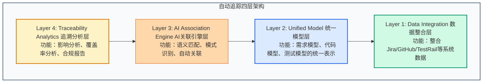

# 需求到代码到测试的自动追踪——AI时代的全链路可追溯性

> *「2024年，一个Bug导致公司损失百万。追溯时发现问题：需求文档写的是A，代码实现的是B，测试验证的是C。三个环节各说各话，没有关联。这不是沟通问题，是可追溯性的缺失。AI时代，我们终于有机会解决这个问题——让需求、代码、测试自动关联，形成全链路的可追溯网络。」*

---

## 一、可追溯性的千年难题

### 什么是软件可追溯性？

**可追溯性（Traceability）**：在软件生命周期中，建立和维护需求、设计、代码、测试、部署等工件之间的关联关系。

**简单说**：知道"这个代码实现了哪个需求"，"这个测试验证了哪个功能"。

### 传统可追溯性的困境

**困境1：手工维护，成本高昂**

```
场景：敏捷开发团队

产品经理：写需求文档（User Story）
    ↓
工程师：实现功能，写代码
    ↓
测试：写测试用例
    ↓
追溯：手工在Excel中维护关联
    ↓
需求变更：需要手工更新所有关联
    ↓
结果：追溯文档永远过时
```

**成本**：维护追溯关系的时间占项目10-20%，但价值有限。

**困境2：工具割裂，数据孤岛**

```
需求管理：Jira
代码仓库：GitHub
测试管理：TestRail
文档管理：Confluence

问题：
- 每个系统有自己的ID体系
- 系统之间没有自动关联
- 需要手工在系统间建立链接
```

**困境3：粒度不匹配**

```
需求粒度："用户可以下单购买商品"
    ↓
代码粒度：数百个函数、数千行代码
    ↓
测试粒度：数十个测试用例
    ↓
问题：
- 一个需求对应多少代码？
- 一个测试覆盖多少需求？
- 无法精确追溯
```

**困境4：变更后的追溯断裂**

```
初始状态：
需求REQ-001 → 代码FUNC-001 → 测试TEST-001

需求变更后：
需求REQ-001（修改） → 代码FUNC-001（修改） → 测试TEST-001（？）

问题：
- 哪些代码需要修改？
- 哪些测试需要更新？
- 追溯关系需要手工重建
```

### 为什么可追溯性重要？

**场景1：影响分析**

```
产品经理："我们要修改价格计算逻辑"

问题：
- 哪些代码会受影响？
- 哪些测试需要重跑？
- 哪些功能可能出问题？

没有可追溯性：只能凭经验猜测
有可追溯性：系统自动分析影响范围
```

**场景2：合规审计**

```
金融行业监管要求：
- 每个功能必须有对应的需求
- 每个需求必须有测试覆盖
- 变更必须有记录和审批

没有可追溯性：合规成本极高
有可追溯性：自动生成合规报告
```

**场景3：Bug根因分析**

```
生产环境发现Bug：

传统方式：
- 查代码、查日志、查需求
- 需要多人协作，耗时数天

AI+可追溯性：
- 自动定位关联的需求、代码、测试
- 分析哪一环节出了问题
- 自动生成根因报告
```

---

## 二、AI如何解决可追溯性难题

### AI带来的新能力

**能力1：语义理解**

```
传统方式：
- 需求文档和代码是文本
- 需要人工阅读理解关联

AI方式：
- AI理解需求语义
- AI理解代码语义
- AI自动匹配关联
```

**能力2：模式识别**

```
传统方式：
- 不知道需求对应的代码在哪
- 需要人工搜索和判断

AI方式：
- 学习历史追溯数据
- 识别需求-代码对应模式
- 自动建议关联关系
```

**能力3：自动化关联**

```
传统方式：
- 手工在系统中建立链接
- 手工维护关联关系

AI方式：
- 自动生成关联
- 自动检测变更影响
- 自动更新追溯关系
```

### AI驱动的可追溯性架构



---

## 三、全链路自动追踪的技术实现

### Layer 1: 数据整合层

**整合多系统数据**

```python
# 需求数据（来自Jira）
requirements = {
    'REQ-001': {
        'title': '用户下单功能',
        'description': '用户可以选择商品并下单购买...',
        'type': 'Story',
        'status': 'Done',
        'acceptance_criteria': [
            '用户可以选择商品',
            '用户可以填写地址',
            '用户可以支付'
        ]
    }
}

# 代码数据（来自GitHub）
code_commits = {
    'commit-abc123': {
        'message': '实现订单创建API',
        'files': ['order_service.py', 'models.py'],
        'author': 'developer@company.com',
        'timestamp': '2025-03-01T10:00:00Z'
    }
}

# 测试数据（来自TestRail）
test_cases = {
    'TEST-001': {
        'title': '验证订单创建成功',
        'steps': [
            '选择商品',
            '填写地址',
            '点击下单'
        ],
        'expected_result': '订单创建成功'
    }
}

# 建立统一数据模型
unified_model = {
    'requirements': requirements,
    'code': code_commits,
    'tests': test_cases
}
```

### Layer 2: 统一模型层

**将不同工件统一表示**

```python
class TraceabilityNode:
    """
    可追溯性图中的节点
    可以是需求、代码、测试等
    """
    def __init__(self, id, type, content, metadata):
        self.id = id
        self.type = type  # 'requirement', 'code', 'test', 'design'
        self.content = content
        self.metadata = metadata
        self.embeddings = None  # 语义向量表示
    
    def generate_embedding(self):
        """生成语义向量"""
        text = f"{self.content['title']} {self.content.get('description', '')}"
        self.embeddings = ai_encoder.encode(text)

class TraceabilityGraph:
    """
    可追溯性图
    节点是工件，边是关联关系
    """
    def __init__(self):
        self.nodes = {}  # id -> TraceabilityNode
        self.edges = []  # (source_id, target_id, relation_type, confidence)
    
    def add_node(self, node):
        self.nodes[node.id] = node
    
    def add_edge(self, source_id, target_id, relation_type, confidence):
        self.edges.append((source_id, target_id, relation_type, confidence))
    
    def get_related(self, node_id, relation_type=None):
        """获取关联节点"""
        related = []
        for edge in self.edges:
            if edge[0] == node_id:
                if relation_type is None or edge[2] == relation_type:
                    related.append((self.nodes[edge[1]], edge[2], edge[3]))
        return related
```

### Layer 3: AI关联引擎层

**语义匹配自动关联**

```python
class AIAssociationEngine:
    def __init__(self):
        self.encoder = SentenceTransformer('all-MiniLM-L6-v2')
        self.graph = TraceabilityGraph()
    
    def find_associations(self, requirement, code_candidates):
        """
        为需求找到最可能关联的代码
        """
        # 编码需求
        req_text = f"{requirement['title']} {requirement['description']}"
        req_embedding = self.encoder.encode(req_text)
        
        associations = []
        
        for code in code_candidates:
            # 编码代码
            code_text = f"{code['message']} {' '.join(code['files'])}"
            code_embedding = self.encoder.encode(code_text)
            
            # 计算语义相似度
            similarity = cosine_similarity([req_embedding], [code_embedding])[0][0]
            
            if similarity > 0.7:  # 阈值
                associations.append({
                    'code_id': code['id'],
                    'confidence': similarity,
                    'reason': 'semantic_similarity'
                })
        
        return sorted(associations, key=lambda x: x['confidence'], reverse=True)
    
    def find_test_coverage(self, requirement, test_candidates):
        """
        找到覆盖需求的测试
        """
        req_text = f"{requirement['title']} {' '.join(requirement.get('acceptance_criteria', []))}"
        req_embedding = self.encoder.encode(req_text)
        
        coverage = []
        
        for test in test_candidates:
            test_text = f"{test['title']} {' '.join(test.get('steps', []))}"
            test_embedding = self.encoder.encode(test_text)
            
            similarity = cosine_similarity([req_embedding], [test_embedding])[0][0]
            
            if similarity > 0.6:
                coverage.append({
                    'test_id': test['id'],
                    'confidence': similarity
                })
        
        return coverage
```

### Layer 4: 追溯分析层

**影响分析和覆盖率分析**

```python
class TraceabilityAnalyzer:
    def __init__(self, graph):
        self.graph = graph
    
    def impact_analysis(self, requirement_id):
        """
        分析需求变更的影响范围
        """
        # 找到关联的代码
        related_code = self.graph.get_related(requirement_id, 'implemented_by')
        
        # 找到关联的测试
        related_tests = self.graph.get_related(requirement_id, 'tested_by')
        
        # 找到下游依赖（这个需求依赖的其他需求）
        downstream = self.graph.get_related(requirement_id, 'depends_on')
        
        return {
            'code_to_update': [c[0].id for c in related_code],
            'tests_to_update': [t[0].id for t in related_tests],
            'downstream_requirements': [d[0].id for d in downstream],
            'impact_score': len(related_code) + len(related_tests)
        }
    
    def coverage_analysis(self):
        """
        分析需求-测试覆盖率
        """
        requirements = [n for n in self.graph.nodes.values() if n.type == 'requirement']
        
        coverage = []
        for req in requirements:
            tests = self.graph.get_related(req.id, 'tested_by')
            coverage.append({
                'requirement_id': req.id,
                'requirement_title': req.content['title'],
                'test_count': len(tests),
                'is_covered': len(tests) > 0,
                'coverage_confidence': sum([t[2] for t in tests]) / len(tests) if tests else 0
            })
        
        return {
            'total_requirements': len(requirements),
            'covered_requirements': sum([1 for c in coverage if c['is_covered']]),
            'coverage_rate': sum([1 for c in coverage if c['is_covered']]) / len(requirements),
            'details': coverage
        }
    
    def generate_compliance_report(self):
        """
        生成合规报告
        """
        coverage = self.coverage_analysis()
        
        report = f"""
# 可追溯性合规报告
生成时间：{datetime.now()}

## 覆盖率统计
- 总需求数：{coverage['total_requirements']}
- 已覆盖需求：{coverage['covered_requirements']}
- 覆盖率：{coverage['coverage_rate']*100:.1f}%

## 未覆盖需求
{chr(10).join([f"- {c['requirement_id']}: {c['requirement_title']}" 
               for c in coverage['details'] if not c['is_covered']])}

## 合规状态
{'✅ 通过' if coverage['coverage_rate'] >= 0.9 else '❌ 未通过（覆盖率低于90%）'}
"""
        return report
```

---

## 四、实战：全链路自动追踪系统

### 场景：电商订单系统

**需求文档**：
```
REQ-001: 用户下单功能
- 用户可以选择商品
- 用户可以填写收货地址
- 用户可以选择支付方式
- 系统生成订单并扣减库存
```

**代码提交**：
```
Commit abc123: 实现订单创建API
- 修改：order_service.py
- 修改：inventory_service.py
```

**测试用例**：
```
TEST-001: 验证订单创建成功
TEST-002: 验证库存扣减正确
TEST-003: 验证支付失败回滚
```

**自动追溯过程**：

```
Step 1: 语义编码
    REQ-001 → 向量 [0.1, 0.3, 0.5, ...]
    Commit abc123 → 向量 [0.12, 0.35, 0.48, ...]
    TEST-001 → 向量 [0.11, 0.32, 0.51, ...]

Step 2: 相似度计算
    REQ-001 ↔ Commit abc123: 0.85 (高相似)
    REQ-001 ↔ TEST-001: 0.82 (高相似)
    REQ-001 ↔ TEST-002: 0.75 (中相似)
    REQ-001 ↔ TEST-003: 0.60 (低相似)

Step 3: 建立关联
    REQ-001 --implemented_by--> Commit abc123 (confidence: 0.85)
    REQ-001 --tested_by--> TEST-001 (confidence: 0.82)
    REQ-001 --tested_by--> TEST-002 (confidence: 0.75)

Step 4: 可视化追溯图
    [REQ-001] --> [Commit abc123]
        |
        +--> [TEST-001]
        +--> [TEST-002]
```

### 变更场景：需求修改

**变更前**：
```
需求：用户下单后扣减库存

追溯状态：
REQ-001 → Commit abc123 → TEST-002
```

**变更后**：
```
需求：用户下单后扣减库存，但支付失败要回滚

系统自动分析：
- 代码需要修改：inventory_service.py（添加回滚逻辑）
- 测试需要添加：验证回滚场景
- 关联影响：支付模块、订单状态机

自动生成任务：
- 更新代码（AI辅助）
- 添加测试TEST-004
- 更新追溯关系
```

---

## 五、可追溯性的业务价值

### 价值1：降低变更成本

**传统方式**：
```
需求变更 → 人工分析影响 → 可能遗漏 → Bug
成本：高（试错成本）
```

**AI可追溯性**：
```
需求变更 → 自动影响分析 → 全面覆盖 → 无遗漏
成本：低（精确变更）
```

**量化**：变更成本降低50-70%

### 价值2：提升测试效率

**传统方式**：
```
全量回归测试：1000个测试用例，运行2小时
```

**AI可追溯性**：
```
基于变更影响，选择相关测试：50个测试用例，运行5分钟
```

**量化**：测试时间减少90%

### 价值3：合规自动化

**金融行业要求**：
- 每个需求必须有测试覆盖
- 变更必须有完整记录
- 审计必须提供追溯报告

**传统方式**：
- 手工整理文档
- 耗时数周
- 容易遗漏

**AI可追溯性**：
- 自动生成报告
- 耗时数分钟
- 100%准确

**量化**：合规成本降低80%

### 价值4：知识传承

**场景**：核心工程师离职

**传统方式**：
- 知识在大脑中
- 离职后丢失
- 新人上手困难

**AI可追溯性**：
- 知识在追溯图中
- 需求-代码-测试关联清晰
- 新人快速理解系统

**量化**：新人上手时间减少60%

---

## 六、写在最后：从不可追溯到全链路透明

### 软件工程的透明度革命

**过去**：
```
需求 → ? → 代码 → ? → 测试
     ↑          ↑
   黑盒        黑盒
```

**现在**：
```
需求 → 自动关联 → 代码 → 自动关联 → 测试
     ↑                    ↑
   透明                 透明
```

AI让全链路透明成为可能。

### 可追溯性的终极目标

**不是**：为了追溯而追溯
**而是**：让软件系统可理解、可维护、可信任

**当每个代码片段都知道**:
- 为什么存在（对应的需求）
- 是否正确（对应的测试）
- 影响范围（上下游关联）

**我们就拥有了真正智能的软件工程**。

---

## 📚 延伸阅读

### 可追溯性标准
- **ISO/IEC/IEEE 29148**: 需求和可追溯性标准
- **DO-178C**: 航空软件可追溯性标准
- **IEC 62304**: 医疗器械软件可追溯性

### 技术实现
- **Knowledge Graphs**: 知识图谱技术
- **NLP for Traceability**: 自然语言处理在可追溯性中的应用
- **Semantic Web**: 语义网技术

### 工具实践
- **Jira + GitHub Integration**: 需求和代码关联
- **TestRail + Jira**: 测试和需求关联
- **End-to-End Traceability Tools**: 全链路可追溯性工具

---

*Published on 2026-03-09*  
*深度阅读时间：约 17 分钟*

**AI-Native软件工程系列 #07** —— 需求到代码到测试的自动追踪
