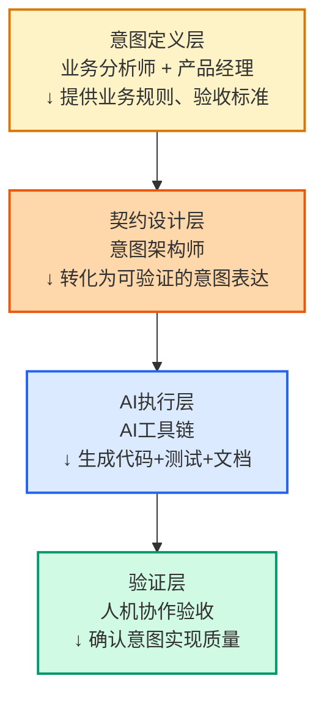

> **TL;DR**
> 
> 本文核心观点：
> 1. **传统TDD已死** — 当AI能秒级生成测试，手写测试的价值定位崩塌
> 2. **测试目的转变** — 从"验证正确性"转向"约束意图表达"
> 3. **新契约诞生** — 人类负责意图，AI负责实现，测试成为契约语言
> 4. **AI-DD崛起** — Prompt-Driven Development正在取代TDD成为新范式

---

## 📋 本文结构

1. [TDD的黄昏](#tdd的黄昏) — 为什么传统测试先行失效了
2. [意图即契约](#意图即契约) — 测试角色的根本性转变
3. [AI-DD新范式](#ai-dd新范式) — Prompt如何成为新测试
4. [实践重构](#实践重构) — 从Red-Green-Refactor到Prompt-Generate-Validate
5. [组织 implications](#组织-implications) — 团队需要哪些新能力
6. [结论](#结论) — 测试工程师的下一步

---

## TDD的黄昏

> 💡 **Key Insight**
> 
> TDD的真正价值从来不是"测试"，而是"驱动设计"。当AI可以生成任何测试时，手写测试的"设计驱动"价值被稀释到趋近于零。

Kent Beck 1999年提出TDD时，测试是稀缺资源。

写测试需要时间、技能、耐心。测试先行强迫开发者先想清楚"我想要什么"，再动手实现。这个过程中的思维摩擦，恰恰是设计的炼金石。

但2026年的现实是：

| 场景 | 传统TDD | AI-Native方式 |
|------|---------|--------------|
| 生成一个单元测试 | 5-15分钟 | 5-15秒 |
| 覆盖率从0到80% | 数小时 | 数分钟 |
| 边界条件识别 | 依赖经验 | AI自动枚举 |
| 测试维护成本 | 随代码膨胀 | 可重新生成 |

**测试不再稀缺。**

当AI可以在几秒内为一个函数生成20个测试用例（包括边界条件、异常路径、并发场景），手写测试的"验证正确性"价值归零。

开发者开始问：如果AI生成的测试比我自己写的更全面，我为什么还要写测试？

---

## 意图即契约

> 💡 **Key Insight**
> 
> 在AI时代，测试的核心功能从"验证代码正确性"转变为"向AI精确传达人类意图"。

传统TDD的循环是：

```
Red → Green → Refactor
(写测试 → 写实现 → 重构)
```

AI时代的循环正在变成：

```
Intent → Generate → Validate
(表达意图 → AI生成 → 验证契约)
```

**测试的新角色是"契约"**

不是验证代码是否正确，而是回答：
- 这是否符合我的原始意图？
- 边界条件是否被正确理解？
- 异常场景是否在考虑范围内？

| 维度 | 传统测试 | AI时代契约 |
|------|---------|-----------|
| 主要目的 | 验证实现正确 | 约束AI生成范围 |
| 编写者 | 开发者 | 人类+AI协作 |
| 更新频率 | 随代码修改 | 随意图调整 |
| 失败含义 | Bug存在 | 意图理解偏差 |

当一个测试失败时，问题可能不在代码，而在"AI误解了意图"。这时候需要修正的不是实现，而是契约本身。

---

## AI-DD新范式

> 💡 **Key Insight**
> 
> Prompt就是新测试。一个精心设计的Prompt包含了输入、约束、期望输出——这正是测试的本质。

让我们对比三种表达方式：

**传统测试（JUnit）**：
```java
@Test
void shouldCalculateDiscountForVIP() {
    Customer vip = new Customer("VIP", 1000);
    Order order = new Order(vip, 500);
    assertEquals(450, order.getFinalAmount());
}
```

**BDD（Gherkin）**：
```gherkin
Scenario: VIP customer gets 10% discount
  Given a VIP customer with 1000 points
  When they place an order of $500
  Then the final amount should be $450
```

**AI-DD（Prompt）**：
```
实现订单折扣计算：
- VIP客户（积分≥1000）享受10%折扣
- 普通客户无折扣
- 输入：客户类型、积分、订单金额
- 输出：最终应付金额（整数）
- 需要处理边界：负金额、零积分、超大数值
```

**三种形式，同一本质。**

但Prompt的优势在于：它是AI可以直接消费的"测试"。不需要额外的DSL，不需要转换层，意图即代码。

---

## 实践重构

> 💡 **Key Insight**
> 
> 未来的测试工程师不是写测试的人，而是设计"意图验证框架"的人。

### 新工作流程

**阶段一：意图表达（人类主导）**
- [ ] 用自然语言精确描述需求
- [ ] 定义输入/输出契约
- [ ] 枚举边界条件和异常场景
- [ ] 提供参考示例（Few-shot）

**阶段二：AI生成（AI主导）**
- [ ] AI生成实现代码
- [ ] AI同步生成测试套件
- [ ] AI解释设计决策

**阶段三：契约验证（人机协作）**
- [ ] 审查AI是否正确理解意图
- [ ] 验证边界条件覆盖
- [ ] 确认异常处理策略
- [ ] 批准或要求重新生成

### 测试金字塔的坍塌

```
        ▲
       ▲▲▲      E2E Tests (意图验收)
      ▲▲▲▲▲
     ▲▲▲▲▲▲▲    Integration (契约验证)
    ▲▲▲▲▲▲▲▲▲
   ▲▲▲▲▲▲▲▲▲▲▲   Unit Tests (AI内部使用)
```

**人类只关心顶层两层：**
- 我的意图是否被正确实现？（E2E）
- 模块间契约是否被遵守？（Integration）

单元测试变成AI的"内部实现细节"，就像今天的编译器优化一样——我们知道它在做，但不关心具体怎么做。

---

## 组织 implications

> 💡 **Key Insight**
> 
> 测试团队的核心能力从"写测试"转向"定义可验证的意图"。这需要更强的业务理解，而不是更强的编程技巧。

### 角色转变

| 传统角色 | 新角色 | 能力要求变化 |
|---------|-------|-------------|
| QA工程师 | 意图架构师 | 业务深度↑ 编码技巧↓ |
| 测试开发 | 契约设计师 | 系统设计↑ 框架开发↓ |
| 自动化测试 | AI测试协调员 | Prompt工程↑ 脚本编写↓ |

### 新技能栈

**必须掌握：**
- 精确的自然语言表达
- 边界条件分析
- 契约式设计思维
- Prompt工程基础

**不再核心：**
- 特定测试框架的深度使用
- 复杂的测试数据构造
- 页面对象模式等模式
- 大量的断言编写

### 组织结构调整



---

## 结论

### 🎯 Takeaway

| 传统TDD思维 | AI-Native思维 |
|------------|--------------|
| 测试是验证工具 | 测试是契约语言 |
| 先写测试再写代码 | 先表达意图再验证实现 |
| 测试覆盖率是目标 | 意图覆盖率是目标 |
| 测试需要维护 | 契约随意图演化 |
| 测试工程师写测试 | 意图架构师设计契约 |

TDD没有死，只是完成了它的历史使命。

它强迫我们"先想清楚再动手"——这个核心洞察依然正确。只是现在，"想清楚"的方式变了：不是写一个具体的测试函数，而是给AI一个精确的意图描述。

**测试先行 → 意图先行**

**Test-Driven Development → Intent-Driven Development**

这是同一场革命的延续。

> "工具会过时，但清晰表达意图的能力永远稀缺。"

---

## 📚 延伸阅读

**经典案例**
- GitHub Copilot的测试生成能力评估：当AI能生成测试时，开发者的测试策略如何调整
- Netflix的契约测试实践：从单元测试到消费者驱动契约的演进

**本系列相关**
- [SDD 2.0：用户故事的Prompt工程化重构](#) (第2篇)
- [PDD：Prompt作为第一等制品](#) (第6篇)
- [CI/CD的AI注入点](#) (第7篇)

**学术理论**
- 《Growing Object-Oriented Software, Guided by Tests》(Freeman & Pryce): TDD的经典阐释，理解测试的本质目的
- 《Behavior-Driven Development with Cucumber》(Wynne & Hellesoy): 从测试到行为的转变
- 《Specification by Example》(Gojko Adzic): 实例化需求的思想基础

---

*AI-Native软件工程系列 #1*
*深度阅读时间：约 8 分钟*
