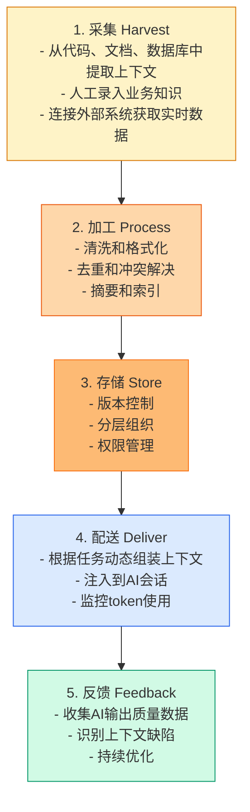
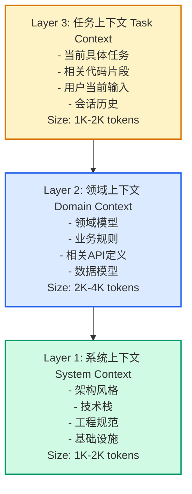

> **TL;DR**
> 
003e 本文核心观点：
> 1. **上下文即一切** — AI输出的质量90%取决于输入的上下文质量
> 2. **Context as Code** — 上下文需要被工程化管理，而不是随意拼凑
> 3. **分层架构** — 系统上下文、领域上下文、任务上下文的分层管理
> 4. **竞争壁垒** — 高质量上下文是AI时代企业的核心知识产权

---

## 📋 本文结构

1. [为什么上下文如此重要](#为什么上下文如此重要) — 上下文决定AI能力的上限
2. [Context as Code](#context-as-code) — 上下文的工程化管理
3. [分层上下文架构](#分层上下文架构) — 三层上下文模型
4. [上下文管理系统](#上下文管理系统) — 工具与实践
5. [组织能力建设](#组织能力建设) — 上下文工程师新角色
6. [结论](#结论) — 得上下文者得天下

---

## 为什么上下文如此重要

> 💡 **Key Insight**
> 
003e LLM的知识是通用的，但价值是具体的。上下文是把通用AI转化为专业AI的转换器。

### 同一个Prompt，不同的结果

**场景：让AI实现一个支付功能**

**上下文A（贫乏）：**
```
实现一个支付接口。
```
**输出：** 一个基础的支付函数，缺少错误处理、安全考虑、业务规则。

**上下文B（丰富）：**
```
系统：跨境电商平台
模块：支付网关
约束：
- 支持Visa/MasterCard/支付宝/微信支付
- 符合PCI DSS Level 1标准
- 支持3D Secure 2.0
- 汇率实时转换（对接XE API）
- 失败订单自动重试3次
- 所有交易记录审计日志
- 支付超时：15分钟
业务规则：
- 单笔限额：$10,000 USD
- 日累计限额：$50,000 USD
- 高风险国家需人工审核
技术栈：Node.js + Stripe SDK
```
**输出：** 生产级的支付模块实现，包含完整的错误处理、安全控制、业务逻辑。

**差异根源：上下文。**

### 上下文质量公式

```
AI输出质量 = f(模型能力, 上下文质量, Prompt质量)

其中：
- 模型能力：你控制不了（用最好的）
- Prompt质量：可以学习提升
- 上下文质量：90%的差异来源
```

| 维度 | 低质量上下文 | 高质量上下文 |
|------|------------|------------|
| 完整性 | 碎片化、缺失关键信息 | 全面覆盖业务/技术约束 |
| 结构化 | 随意组织 | 分层清晰、易于消费 |
| 准确性 | 包含错误/过时信息 | 实时更新、经审核 |
| 可获取性 | 分散在各处 | 集中管理、按需加载 |
| 版本一致性 | 上下文间矛盾 | 版本对齐、相互兼容 |

---

## Context as Code

> 💡 **Key Insight**
> 
003e 如果Prompt是第一等制品，上下文就是制品的原材料。原材料需要被采购、存储、加工、配送——这就是上下文工程。

### 上下文的生命周期



### 上下文即代码（CaC）

```yaml
# context/ecommerce-system.yaml
version: "3.2.1"
name: ecommerce-platform
scope: system

# 系统架构上下文
architecture:
  style: microservices
  services:
    - name: user-service
      tech: [Node.js, PostgreSQL]
      responsibilities: [用户管理, 认证授权]
    - name: order-service
      tech: [Go, MongoDB]
      responsibilities: [订单生命周期, 状态机]
    - name: payment-service
      tech: [Java, MySQL]
      responsibilities: [支付处理, 对账]
  
  communication:
    sync: [gRPC]
    async: [Kafka]
    patterns: [Saga, CQRS]

# 技术规范上下文
standards:
  code_style: "@org/eslint-config-standard"
  api_design: RESTful + OpenAPI 3.0
  security: [OAuth2, JWT, mTLS]
  observability: [OpenTelemetry, Prometheus, Grafana]

# 业务规则上下文
business_rules:
  order:
    max_items_per_order: 100
    auto_cancel_hours: 24
    refund_policy: "7天无理由"
  payment:
    supported_methods: [alipay, wechat, credit_card]
    currency: CNY
    tax_rate: 0.13

# 外部依赖上下文
integrations:
  - name: alipay-sdk
    version: "^4.0.0"
    docs: https://...
  - name: wechat-pay
    version: "^3.0.0"
    docs: https://...
```

### 上下文版本与依赖

```yaml
# context/order-service.yaml
version: "2.1.0"
name: order-service
scope: domain

# 继承系统级上下文
extends:
  - context: ecommerce-system
    version: "3.2.x"  # 语义化版本约束
    
# 依赖其他领域上下文
dependencies:
  - context: user-domain
    version: "1.5.x"
    import: [User, UserType]
  - context: payment-domain
    version: "2.0.x"
    import: [PaymentMethod, PaymentStatus]
  - context: inventory-domain
    version: "1.8.x"
    import: [StockLevel, Reservation]

# 本领域上下文
entities:
  Order:
    attributes: [id, user_id, items, status, created_at]
    states: [created, paid, processing, shipped, delivered, cancelled]
    
  OrderItem:
    attributes: [product_id, quantity, unit_price, subtotal]
    
constraints:
  - "订单创建时必须验证库存"
  - "已支付订单不可修改商品"
  - "取消订单自动释放库存"
```

---

## 分层上下文架构

> 💡 **Key Insight**
> 
003e 不是把所有的上下文都扔给AI，而是按需分层组装。就像OS的内存管理一样，只加载当前需要的。

### 三层上下文模型



### 上下文组装策略

```python
class ContextAssembler:
    def assemble(self, task: Task) -> Context:
        context = Context()
        
        # 1. 加载系统上下文（精简版）
        system_ctx = self.load_system_context(
            scope="relevant",  # 只加载相关部分
            task_type=task.type
        )
        context.add_layer(system_ctx, priority=1)
        
        # 2. 加载领域上下文
        domain_ctx = self.load_domain_context(
            domain=task.domain,
            version=self.resolve_version(task.domain)
        )
        context.add_layer(domain_ctx, priority=2)
        
        # 3. 加载相关实体上下文
        entities_ctx = self.load_entity_context(
            entities=task.related_entities
        )
        context.add_layer(entities_ctx, priority=3)
        
        # 4. 加载任务特定上下文
        task_ctx = TaskContext(
            description=task.description,
            constraints=task.constraints,
            examples=task.examples
        )
        context.add_layer(task_ctx, priority=4)
        
        # 5. 智能截断（如果超token限制）
        return self.smart_truncate(context, max_tokens=8000)
```

### 上下文缓存与复用

```python
class ContextCache:
    """缓存常用上下文组合，避免重复加载"""
    
    def __init__(self):
        self.cache = {}
    
    def get_or_create(self, context_key: str) -> Context:
        if context_key in self.cache:
            return self.cache[context_key]
        
        # 创建新上下文
        context = self.assemble_context(context_key)
        
        # 缓存（LRU策略）
        self.cache[context_key] = context
        return context
    
    def invalidate(self, context_type: str, version: str):
        """当上下文更新时，使相关缓存失效"""
        keys_to_remove = [
            k for k in self.cache.keys()
            if k.startswith(f"{context_type}@{version}")
        ]
        for key in keys_to_remove:
            del self.cache[key]
```

---

## 上下文管理系统

> 💡 **Key Insight**
> 
003e 上下文管理不是可选的奢侈品，而是AI-Native开发的刚需。没有它，团队会在重复的上下文构建中浪费90%的时间。

### 系统架构

```
┌─────────────────────────────────────────┐
│           开发者工具层                   │
│  IDE插件 │ CLI工具 │ Web界面            │
└─────────────────────────────────────────┘
                    ↓
┌─────────────────────────────────────────┐
│           API网关层                      │
│  认证 │ 限流 │ 路由 │ 缓存               │
└─────────────────────────────────────────┘
                    ↓
┌─────────────────────────────────────────┐
│           上下文服务层                   │
├─────────────────────────────────────────┤
│  ┌─────────────┐    ┌─────────────┐    │
│  │ 组装引擎    │    │ 版本管理    │    │
│  └─────────────┘    └─────────────┘    │
│  ┌─────────────┐    ┌─────────────┐    │
│  │ 索引搜索    │    │ 依赖解析    │    │
│  └─────────────┘    └─────────────┘    │
└─────────────────────────────────────────┘
                    ↓
┌─────────────────────────────────────────┐
│           存储层                         │
│  Git仓库 │ 向量数据库 │ 缓存(Redis)     │
└─────────────────────────────────────────┘
```

### 核心功能

**1. 上下文发现**
```bash
# 搜索相关上下文
ctx search "payment processing"

Results:
  1. context/payment-domain@2.1.0
     描述: 支付领域上下文
     匹配度: 95%
     
  2. context/order-service@1.5.0
     描述: 订单服务（含支付集成）
     匹配度: 78%
```

**2. 上下文组装**
```bash
# 为当前任务组装上下文
ctx assemble --task "实现退款功能" \
             --domain payment \
             --output context.txt
```

**3. 上下文注入**
```bash
# 将上下文注入AI会话
ctx inject --file context.txt --to claude

# 或直接生成Prompt
ctx prompt --task "实现退款功能" \
           --template crud-operation
```

**4. 上下文验证**
```bash
# 检查上下文完整性
ctx validate context/payment-domain.yaml

Errors:
  - 缺少PCI DSS合规要求
  - 汇率API版本已过期
  - 与user-domain@1.5.0存在约束冲突
```

---

## 组织能力建设

> 💡 **Key Insight**
> 
003e 上下文工程师是AI时代的新角色。他们不写业务代码，但决定AI写代码的质量上限。

### 新角色：上下文工程师（Context Engineer）

**职责：**
- 设计和维护组织级上下文架构
- 建立上下文编写标准和最佳实践
- 开发上下文管理工具和流程
- 培训开发者有效使用上下文
- 监控上下文质量和使用效果

**技能要求：**
| 技能 | 重要性 | 说明 |
|------|--------|------|
| 领域建模 | ⭐⭐⭐⭐⭐ | 理解业务，抽象领域概念 |
| 信息架构 | ⭐⭐⭐⭐⭐ | 组织大规模信息系统 |
| Prompt工程 | ⭐⭐⭐⭐ | 理解AI如何消费上下文 |
| 技术写作 | ⭐⭐⭐⭐ | 清晰表达复杂概念 |
| 工具开发 | ⭐⭐⭐ | 构建上下文管理工具 |

### 上下文成熟度模型

| 级别 | 特征 | 典型表现 |
|------|------|----------|
| **L1 混乱** | 无上下文管理，每次都从零开始 | 每次AI对话都重复解释系统背景 |
| **L2 个人** | 个人积累了一些上下文片段 | 有私人文档，但不共享 |
| **L3 团队** | 团队有共享的上下文库 | Confluence/Notion有组织 |
| **L4 工程化** | 上下文即代码，有管理流程 | Git管理，CI/CD验证 |
| **L5 智能** | AI辅助上下文组装和优化 | 自动发现、自动推荐、自动优化 |

### 实施路线图

**阶段1：基础建设（1-2月）**
- [ ] 建立上下文编写规范
- [ ] 创建核心领域上下文文档
- [ ] 搭建上下文Git仓库

**阶段2：工具化（2-3月）**
- [ ] 开发上下文管理CLI工具
- [ ] 集成IDE插件
- [ ] 建立上下文发布流程

**阶段3：规模化（3-6月）**
- [ ] 推广到全团队
- [ ] 建立上下文质量度量
- [ ] 培养上下文工程师

**阶段4：智能化（6-12月）**
- [ ] AI辅助上下文发现
- [ ] 自动上下文优化建议
- [ ] 上下文使用数据分析

---

## 结论

### 🎯 Takeaway

| 无上下文工程 | 有上下文工程 |
|------------|------------|
| AI输出不稳定 | AI输出可预期 |
| 每次从零开始 | 复用组织知识 |
| 个人经验依赖 | 团队协作基础 |
| 隐性知识流失 | 知识资产化 |
| AI是辅助工具 | AI是生产力倍增器 |

上下文工程是AI-Native开发的**隐性基础设施**。

它不直接产生代码，但决定了代码的质量上限。不直接创造功能，但决定了功能的实现效率。

在AI时代，组织的核心竞争力不再是"有多少人懂编程"，而是"有多少高质量上下文可以被AI利用"。

> "代码可以被复制，模型可以被购买，但上下文的积累是独一无二的护城河。"

---

## 📚 延伸阅读

**经典案例**
- GitHub Copilot的上下文处理：如何分析代码库提供相关建议
- Sourcegraph的代码智能：大规模代码库的上下文理解

**本系列相关**
- [PDD：Prompt作为第一等制品](#) (第5篇)
- [CI/CD的AI注入点](#) (第7篇)
- [DDD meets LLM](#) (第3篇)

**学术理论**
- 《The Architecture of Open Source Applications》: 理解复杂系统的上下文
- 《Working Effectively with Legacy Code》(Michael Feathers): 如何在缺乏上下文的代码中工作
- 《Information Architecture》(Louis Rosenfeld): 信息组织的系统方法

---

*AI-Native软件工程系列 #6*
*深度阅读时间：约 11 分钟*
