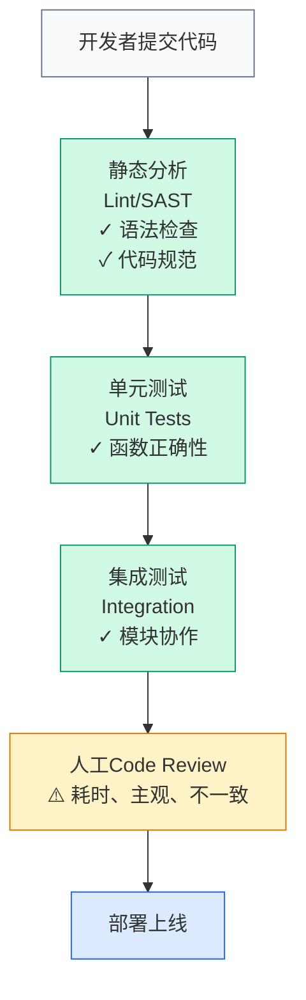

> **TL;DR**
> 
003e 本文核心观点：
> 1. **AI是新型验证层** — LLM可以在传统测试无法覆盖的维度进行质量检查
> 2. **12个注入点** — 从代码提交到部署上线的全流程AI卡点
> 3. **分层防御** — 不同阶段的AI验证侧重点不同，形成纵深防御
> 4. **人机协作** — AI负责初筛和模式识别，人类负责最终决策

---

## 📋 本文结构

1. [为什么CI/CD需要AI](#为什么cicd需要ai) — 传统验证的盲区
2. [12个AI注入点详解](#12个ai注入点详解) — 全流程卡点设计
3. [分层验证架构](#分层验证架构) — 防御深度策略
4. [实施路线图](#实施路线图) — 渐进式改造方案
5. [成本与收益分析](#成本与收益分析) — ROI考量
6. [结论](#结论) — AI-Native DevOps的新范式

---

## 为什么CI/CD需要AI

> 💡 **Key Insight**
> 
003e 传统测试验证"代码是否符合规格"，AI验证"代码是否符合意图"。规格可能是错的，但意图是真相。

### 传统CI/CD的局限



**问题：CR成为瓶颈，且无法发现意图偏离**

**AI能发现的问题（传统测试发现不了）：**

| 问题类型 | 示例 | 传统测试 | AI验证 |
|---------|------|---------|--------|
| 意图偏离 | PR实现了A功能，但需求实际要B | ❌ | ✅ |
| 语义错误 | 变量名`total`实际是平均值 | ❌ | ✅ |
| 设计缺陷 | 代码能跑，但架构不合理 | ❌ | ✅ |
| 安全盲点 | 业务逻辑漏洞（非技术漏洞） | ❌ | ✅ |
| 文档不一致 | 代码改了，注释没改 | ❌ | ✅ |
| 知识债务 | 实现方式与团队标准不符 | ❌ | ✅ |

---

## 12个AI注入点详解

> 💡 **Key Insight**
003e 
003e AI验证不是取代现有测试，而是填补测试覆盖不了的维度。每个注入点解决特定问题。

### 注入点全景图

```
代码提交
    ↓
┌─────────────────────────────────────────────────────┐
│ 卡点1: 提交信息验证 (Commit Message Review)          │
│ 卡点2: 变更意图匹配 (Intent Alignment Check)         │
└─────────────────────────────────────────────────────┘
    ↓
预构建
    ↓
┌─────────────────────────────────────────────────────┐
│ 卡点3: 代码语义审查 (Semantic Code Review)           │
│ 卡点4: 安全漏洞识别 (AI Security Scan)               │
│ 卡点5: 复杂度预警 (Complexity Alert)                 │
└─────────────────────────────────────────────────────┘
    ↓
构建
    ↓
┌─────────────────────────────────────────────────────┐
│ 卡点6: 依赖风险评估 (Dependency Risk Assessment)     │
│ 卡点7: 配置合理性检查 (Config Sanity Check)          │
└─────────────────────────────────────────────────────┘
    ↓
测试
    ↓
┌─────────────────────────────────────────────────────┐
│ 卡点8: 测试质量评估 (Test Quality Review)            │
│ 卡点9: 覆盖率盲区分析 (Coverage Gap Analysis)        │
└─────────────────────────────────────────────────────┘
    ↓
人工审查
    ↓
┌─────────────────────────────────────────────────────┐
│ 卡点10: PR摘要生成 (PR Summary Generation)           │
│ 卡点11: 审查优先级排序 (Review Priority Ranking)     │
└─────────────────────────────────────────────────────┘
    ↓
部署前
    ↓
┌─────────────────────────────────────────────────────┐
│ 卡点12: 部署风险评估 (Deployment Risk Score)         │
└─────────────────────────────────────────────────────┘
    ↓
  上线
```

### 卡点详解

**卡点1: 提交信息验证**
```python
def validate_commit_message(message: str, diff: str) -> ValidationResult:
    """
    检查提交信息是否准确描述变更
    """
    issues = []
    
    # 检查类型标签与变更匹配
    if message.startswith("feat:") and "test" in diff.lower():
        issues.append("类型为'feat'但主要是测试代码，考虑用'test:'")
    
    # 检查描述与代码变更一致
    described_files = extract_files_from_message(message)
    actual_files = extract_files_from_diff(diff)
    
    if set(described_files) != set(actual_files):
        issues.append(f"提交信息提到的文件与变更不符")
    
    # 检查是否有关联Issue
    if not re.search(r'#\d+', message) and not is_minor_change(diff):
        issues.append("建议关联相关Issue")
    
    return ValidationResult(passed=len(issues)==0, issues=issues)
```

**卡点2: 变更意图匹配**
```python
def check_intent_alignment(pr_description: str, code_changes: str) -> AlignmentScore:
    """
    验证代码变更是否与PR描述的意图一致
    """
    # 提取PR描述中的意图
    described_intent = llm.extract_intent(pr_description)
    
    # 分析代码变更的实际意图
    actual_intent = llm.analyze_code_intent(code_changes)
    
    # 计算匹配度
    alignment = semantic_similarity(described_intent, actual_intent)
    
    if alignment < 0.7:
        return AlignmentScore(
            score=alignment,
            warning="代码变更与描述意图存在显著偏差",
            details=llm.generate_deviation_report(described_intent, actual_intent)
        )
```

**卡点3: 代码语义审查**
```python
def semantic_code_review(code: str, context: Context) -> List[Issue]:
    """
    超越语法层面的语义审查
    """
    issues = []
    
    # 检查命名语义
    for var_name in extract_variables(code):
        if is_misleading_name(var_name, code):
            issues.append(Issue(
                type="语义错误",
                message=f"变量'{var_name}'的名称与实际用途不符",
                suggestion=llm.suggest_better_name(var_name, code)
            ))
    
    # 检查设计模式误用
    if detects_pattern_misuse(code):
        issues.append(Issue(
            type="设计缺陷",
            message="检测到设计模式的不当使用",
            explanation=llm.explain_pattern_issue(code)
        ))
    
    # 检查业务逻辑漏洞
    business_issues = llm.analyze_business_logic(code, context.domain)
    issues.extend(business_issues)
    
    return issues
```

**卡点4: 安全漏洞识别（AI增强）**
```python
def ai_security_scan(code: str, threat_model: ThreatModel) -> List[Vulnerability]:
    """
    传统SAST发现不了的业务逻辑漏洞
    """
    vulnerabilities = []
    
    # 检查权限绕过
    auth_flow = extract_auth_flow(code)
    if llm.detect_auth_bypass(auth_flow, threat_model):
        vulnerabilities.append(Vulnerability(
            severity="HIGH",
            type="权限绕过",
            description="可能存在越权访问漏洞",
            scenario=llm.generate_attack_scenario(auth_flow)
        ))
    
    # 检查竞争条件
    if has_concurrent_operations(code):
        race_conditions = llm.analyze_race_conditions(code)
        vulnerabilities.extend(race_conditions)
    
    # 检查业务逻辑漏洞（如价格操纵、库存逻辑错误）
    business_vulns = llm.analyze_business_vulnerabilities(code, threat_model)
    vulnerabilities.extend(business_vulns)
    
    return vulnerabilities
```

**卡点5: 复杂度预警**
```python
def complexity_alert(code: str, historical_data: Data) -> Optional[Alert]:
    """
    检测异常复杂度增长
    """
    current_complexity = calculate_complexity(code)
    baseline_complexity = historical_data.average_complexity
    
    if current_complexity > baseline_complexity * 1.5:
        return Alert(
            level="WARNING",
            message=f"复杂度较基线增长{growth_rate}%",
            details=llm.explain_complexity(code),
            suggestions=llm.suggest_simplification(code)
        )
```

**卡点6: 依赖风险评估**
```python
def assess_dependency_risk(dependencies: List[Dependency]) -> RiskReport:
    """
    AI评估依赖包的风险
    """
    risks = []
    
    for dep in dependencies:
        risk_factors = []
        
        # 检查维护活跃度
        if llm.check_maintainer_activity(dep) == "low":
            risk_factors.append("维护不活跃")
        
        # 检查社区安全声誉
        if llm.check_security_reputation(dep) < 0.5:
            risk_factors.append("安全声誉差")
        
        # 检查与项目技术栈的兼容性
        compatibility = llm.assess_compatibility(dep, project_stack)
        if compatibility < 0.7:
            risk_factors.append(f"技术栈兼容性低({compatibility})")
        
        if risk_factors:
            risks.append(DependencyRisk(
                package=dep.name,
                factors=risk_factors,
                recommendation=llm.suggest_alternative(dep, risk_factors)
            ))
    
    return RiskReport(risks=risks)
```

**卡点7-12简要说明：**

| 卡点 | 功能 | AI能力 |
|------|------|--------|
| **7. 配置合理性** | 检查环境配置是否有明显错误 | 模式识别、异常检测 |
| **8. 测试质量** | 评估测试用例的覆盖度和有效性 | 语义理解、漏洞发现 |
| **9. 覆盖率盲区** | 识别高风险未覆盖代码 | 风险评估、优先级排序 |
| **10. PR摘要** | 自动生成人类可读的变更摘要 | 文本摘要、重点提取 |
| **11. 审查优先级** | 智能排序PR审查顺序 | 风险评分、影响分析 |
| **12. 部署风险** | 综合评估上线风险 | 多维度分析、预测模型 |

---

## 分层验证架构

> 💡 **Key Insight**
003e 
003e AI验证不是单一检查点，而是分层防御。越快发现的错误，修复成本越低。

### 防御层次

```
Layer 1: 提交前 (Pre-commit)
├─ 本地AI插件实时检查
├─ 反馈延迟: < 1秒
└─ 拦截: 语法错误、明显语义问题

Layer 2: 提交时 (On-commit)
├─ 提交信息验证、意图匹配
├─ 反馈延迟: < 5秒
└─ 拦截: 提交规范、方向性错误

Layer 3: 构建前 (Pre-build)
├─ 语义审查、安全扫描、复杂度检查
├─ 反馈延迟: 10-30秒
└─ 拦截: 设计缺陷、安全漏洞

Layer 4: 构建后 (Post-build)
├─ 依赖评估、配置检查、测试质量
├─ 反馈延迟: 1-5分钟
└─ 拦截: 集成问题、配置错误

Layer 5: 人工审查前 (Pre-review)
├─ PR摘要、优先级排序
├─ 反馈延迟: 即时
└─ 拦截: 信息不完整、审查效率低

Layer 6: 部署前 (Pre-deploy)
├─ 综合风险评估
├─ 反馈延迟: 2-10分钟
└─ 拦截: 高风险变更
```

---

## 实施路线图

> 💡 **Key Insight**
003e 
003e 不需要一次性实施所有12个卡点。从痛点最明显、收益最高的开始。

### 推荐实施顺序

**Phase 1: 速赢 (1-2周)**
- [ ] 卡点10: PR摘要生成（降低审查成本）
- [ ] 卡点3: 代码语义审查（发现人工容易漏的问题）
- [ ] 卡点11: 审查优先级（提升审查效率）

**Phase 2: 质量门禁 (2-4周)**
- [ ] 卡点1: 提交信息验证
- [ ] 卡点2: 变更意图匹配
- [ ] 卡点8: 测试质量评估

**Phase 3: 深度防御 (1-2月)**
- [ ] 卡点4: AI安全扫描
- [ ] 卡点5: 复杂度预警
- [ ] 卡点6: 依赖风险评估

**Phase 4: 全面覆盖 (2-3月)**
- [ ] 剩余卡点
- [ ] 统一监控仪表盘
- [ ] 效果度量体系

---

## 成本与收益分析

### 实施成本

| 项目 | 一次性成本 | 持续成本/月 |
|------|-----------|------------|
| LLM API调用 | - | $200-500 |
| 工具开发 | 2-4人月 | 0.5人月维护 |
| 流程改造 | 1-2人月 | - |
| 团队培训 | 0.5人月 | - |

### 预期收益

| 指标 | 改进前 | 改进后 | 提升 |
|------|--------|--------|------|
| Bug漏检率 | 15% | 5% | -67% |
| 平均审查时间 | 45分钟 | 25分钟 | -44% |
| 返工率 | 20% | 8% | -60% |
| 部署事故 | 2次/月 | 0.3次/月 | -85% |

### ROI估算

```
假设：
- 团队规模：20人
- 平均薪资：$10k/月
- 实施成本：4人月开发 + $300/月API

年度成本：$480k + $3.6k = ~$484k
年度收益（保守）：
- 审查效率提升：节省 20人 × 20%时间 × $10k × 12 = $480k
- Bug减少节省：假设每次生产Bug成本$5k × 减少15次 = $75k
- 部署事故减少：每次事故成本$20k × 减少20次 = $400k

年度总收益：~$955k
ROI: (955-484)/484 = 97%
```

---

## 结论

### 🎯 Takeaway

| 传统CI/CD | AI增强CI/CD |
|----------|------------|
| 验证"代码对不对" | 验证"代码对不对 + 意图对不对" |
| 依赖人工Code Review | AI初筛 + 人工终审 |
| 静态规则检查 | 语义理解 + 模式识别 |
| 统一标准 | 自适应标准 |
| 被动发现问题 | 主动预测风险 |

AI注入CI/CD不是锦上添花，而是**必然趋势**。

当代码生成速度提升10倍时，验证速度也必须提升10倍，否则成为新瓶颈。AI是唯一能跟上这个速度的质量保障手段。

**12个卡点不是终点**，而是起点。随着AI能力进化，会有更多维度可以被自动验证。

> "未来的DevOps工程师不是写Pipeline的人，而是设计AI验证策略的人。"

---

## 📚 延伸阅读

**经典案例**
- GitHub Copilot的代码审查功能：AI如何辅助人类审查
- Google's AI-powered code review: 大规模AI审查实践

**本系列相关**
- [PDD：Prompt作为第一等制品](#) (第5篇)
- [CDD：上下文工程即核心竞争力](#) (第6篇)
- [Code Review 2.0流程重构](#) (第8篇，待发布)

**学术理论**
- 《Continuous Delivery》(Jez Humble): CI/CD经典
- 《Accelerate》(Nicole Forsgren): DevOps效能度量
- 《ML for Systems》: 机器学习在系统优化中的应用

---

*AI-Native软件工程系列 #7*
*深度阅读时间：约 13 分钟*
