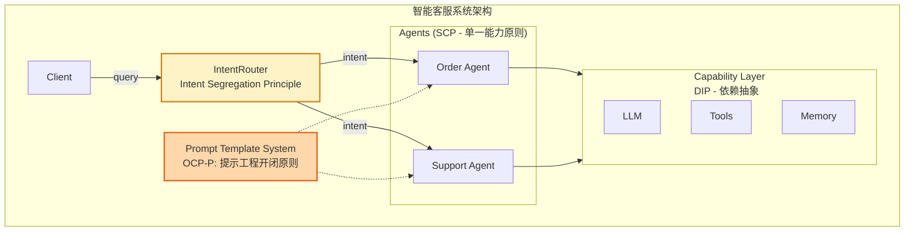

> **TL;DR**
>
> 传统SOLID原则诞生于面向对象编程时代，旨在解决类级别设计的耦合问题。在AI-Native时代，软件系统的核心单元已从类(Class)演变为Agent——具有自主决策能力、上下文感知和工具调用能力的智能实体。本文提出新SOLID原则，将设计哲学从"对象协作"升维到"Agent协作"。核心洞察：Agent不是更好的类，而是完全不同的抽象层次，需要一套全新的设计原则来驾驭这种转变。

---

## 📋 本文结构

1. [SOLID 原则回顾](#3-solid-原则回顾) - 快速重温五大原则
2. [面向对象时代的 SOLID 局限](#4-面向对象时代的-solid-局限) - 为什么它们不再足够
3. [AI-Native 时代的 SOLID 重构](#5-ai-native-时代的-solid-重构) - 从类到 Agent 的范式转移
4. [新 SOLID：Agent 协作设计原则](#6-新-solid适用于-agent-协作的设计原则) - 五大新原则的详细阐述
5. [实战：应用新 SOLID 设计 Agent 系统](#7-实战应用新-solid-设计-agent-系统) - 完整代码示例
6. [反直觉洞察](#8-反直觉洞察) - 那些容易被忽视的真相
7. [工具链与最佳实践](#9-工具链与最佳实践) - 落地指南
8. [结语](#10-结语) - 面向未来的思考

---

## 3. SOLID 原则回顾

在重构之前，让我们快速回顾 Robert C. Martin 在 2000 年提出的 SOLID 原则：

### 3.1 单一职责原则 (Single Responsibility Principle)

> **一个类应该只有一个引起它变化的原因。**

```java
// 违反 SRP
class Employee {
    void calculatePay() { /* ... */ }
    void saveToDatabase() { /* ... */ }
    void generateReport() { /* ... */ }
}

// 遵循 SRP
class Employee { /* 只包含员工数据 */ }
class PayCalculator { void calculate(Employee e) { /* ... */ } }
class EmployeeRepository { void save(Employee e) { /* ... */ } }
class ReportGenerator { void generate(Employee e) { /* ... */ } }
```

### 3.2 开闭原则 (Open/Closed Principle)

> **对扩展开放，对修改关闭。**

```java
// 违反 OCP - 每次新图形都要修改 AreaCalculator
class AreaCalculator {
    double calculate(Object shape) {
        if (shape instanceof Rectangle) { /* ... */ }
        else if (shape instanceof Circle) { /* ... */ }
        return 0;
    }
}

// 遵循 OCP - 通过多态扩展
interface Shape { double area(); }
class Rectangle implements Shape { /* ... */ }
class Circle implements Shape { /* ... */ }
// 新图形只需实现 Shape 接口，无需修改 AreaCalculator
```

### 3.3 里氏替换原则 (Liskov Substitution Principle)

> **子类型必须能够替换其基类型而不改变程序正确性。**

```java
// 违反 LSP - Square 不是真正的 Rectangle
class Rectangle {
    void setWidth(double w) { this.width = w; }
    void setHeight(double h) { this.height = h; }
}
class Square extends Rectangle {
    void setWidth(double w) { this.width = this.height = w; } // 违反 LSP!
}
```

### 3.4 接口隔离原则 (Interface Segregation Principle)

> **客户端不应该被迫依赖它们不使用的接口。**

```java
// 违反 ISP - Worker 被迫实现 eat()
interface Worker { void work(); void eat(); }
class Robot implements Worker {
    void work() { /* ... */ }
    void eat() { throw new UnsupportedOperationException(); } // 被迫实现!
}

// 遵循 ISP
interface Workable { void work(); }
interface Eatable { void eat(); }
class Robot implements Workable { /* 只实现 work() */ }
class Human implements Workable, Eatable { /* 实现两者 */ }
```

### 3.5 依赖倒置原则 (Dependency Inversion Principle)

> **高层模块不应该依赖低层模块，两者都应该依赖抽象。**

```java
// 违反 DIP - Application 直接依赖 MySQLDatabase
class Application {
    private MySQLDatabase database = new MySQLDatabase(); // 紧耦合!
}

// 遵循 DIP
interface Database { void query(String sql); }
class Application {
    private Database database; // 依赖抽象
    Application(Database db) { this.database = db; }
}
```

---

## 4. 面向对象时代的 SOLID 局限

SOLID 原则在 2000-2020 年间指导了数以百万计的软件设计，但在 AI-Native 时代，它们的局限性日益明显：

### 4.1 局限一：假设了确定性的执行模型

传统 SOLID 假设：
- 方法调用是**同步**且**确定**的
- 返回值是可预测的
- 副作用是可控的

但 Agent 的行为是**概率性**的：
- 同样的输入可能产生不同输出
- 执行时间不确定
- 可能调用外部工具产生不可预测副作用

```python
# 传统代码：确定性
class Calculator:
    def add(self, a: int, b: int) -> int:
        return a + b  # 永远确定

# Agent：概率性
class ResearchAgent:
    async def research(self, topic: str) -> str:
        # 每次调用结果可能不同
        # 可能调用搜索引擎、数据库、API
        # 执行时间不确定
        return await self.llm.complete(f"Research: {topic}")
```

### 4.2 局限二：忽视了上下文和状态管理

传统设计将状态封装在对象内部，但 Agent 需要：
- **上下文窗口管理**：有限的 token 预算
- **长期记忆**：跨会话的信息保持
- **工作记忆**：当前任务的临时状态

```python
# 传统：封装状态
class BankAccount:
    def __init__(self):
        self._balance = 0  # 封装在对象内部

# Agent：复杂的上下文管理
class CustomerServiceAgent:
    def __init__(self):
        self.system_prompt = "You are a helpful assistant..."
        self.conversation_history = []  # 需要管理 token 预算
        self.long_term_memory = MemoryStore()  # 向量数据库
        self.current_context = {}  # 工作记忆
```

### 4.3 局限三：无法处理涌现行为

传统设计追求**可预测性**，但 Agent 系统的一个重要特性是**涌现**——整体行为不等于部分之和。

当多个 Agent 协作时，会产生设计者未明确编程的行为。SOLID 原则无法指导这种涌现系统的设计。

### 4.4 局限四：接口定义过于静态

传统接口是编译时契约：

```java
interface PaymentProcessor {
    PaymentResult process(PaymentRequest request);
}
```

但 Agent 的能力是**动态**的：
- 通过 prompt 工程可以"教授"新能力
- 工具调用列表可以动态扩展
- 不同模型版本能力差异巨大

### 4.5 局限五：忽视了反馈和学习循环

传统软件是"编写一次，运行多次"，但 AI 系统需要：
- 从反馈中学习
- 持续优化 prompt
- 版本化管理模型和策略

| 维度 | 传统软件 | AI-Native 系统 |
|------|---------|---------------|
| 正确性 | 确定性 | 概率性 |
| 扩展方式 | 继承/组合 | Prompt 工程 + 工具注册 |
| 状态管理 | 对象字段 | 上下文 + 记忆 |
| 接口 | 静态类型 | 动态能力描述 |
| 演化 | 版本发布 | 持续学习 |

---

## 5. AI-Native 时代的 SOLID 重构

面对上述局限，我们需要一套新的设计原则。这不是对 SOLID 的否定，而是在更高抽象层次上的重构。

### 5.1 从 Class 到 Agent：抽象层次的跃迁

```
面向对象：
  Class → Object → Method Call → Return Value

AI-Native：
  Agent Definition → Agent Instance → Intent + Context → Tool Calling → Response
```

关键区别：

| 特性 | Class | Agent |
|------|-------|-------|
| 激活方式 | 方法调用 | Intent + Context |
| 执行逻辑 | 确定性代码 | LLM + Tool Calling |
| 状态管理 | 字段封装 | Context Window + Memory |
| 能力扩展 | 继承/组合 | Prompt 调整 + Tool 注册 |
| 交互模式 | Request/Response | 多轮对话 + 自主决策 |

### 5.2 从 Interface 到 Intent：契约形式的转变

传统接口定义"能做什么"：

```python
class DataAnalyzer(Protocol):
    def analyze(self, data: DataFrame) -> AnalysisResult: ...
```

Intent 定义"意图和期望结果"：

```python
@dataclass
class AnalysisIntent:
    goal: str  # "分析 Q3 销售趋势"
    constraints: List[str]  # ["使用同比数据", "排除异常值"]
    output_format: str  # "Markdown 报告"
    tools_available: List[str]  # ["sql_query", "chart_generator"]
```

### 5.3 核心转变总结

```mermaid
flowchart TB
    subgraph Paradigm["范式转移全景图"]
        subgraph Traditional["传统 SOLID"]
            Class["Class"]
            Encap["Encapsulation"]
            Method["Method"]
            State["State (fields)"]
            Class --> Encap
            Class --> Method
            Class --> State
        end
        
        subgraph New["新 SOLID (AI-Native)"]
            Agent["Agent"]
            Context["Context Management"]
            Intent["Intent + Tool Calling"]
            Memory["Memory + Working Context"]
            Agent --> Context
            Agent --> Intent
            Agent --> Memory
        end
        
        Class <---> Agent
    end
    
    subgraph Interface["Interface 转变"]
        Interface1["Interface"]
        Static["Static typing"]
        Compile["Compile-time check"]
        Interface1 --> Static
        Interface1 --> Compile
        
        Contract["Capability Contract"]
        Dynamic["Dynamic capability desc"]
        Runtime["Runtime validation"]
        Contract --> Dynamic
        Contract --> Runtime
        
        Interface1 <---> Contract
    end
    
    subgraph Inheritance["Inheritance 转变"]
        Inherit["Inheritance"]
        IsA["Is-a relationship"]
        Override["Method override"]
        Inherit --> IsA
        Inherit --> Override
        
        Composition["Composition + Prompting"]
        HasCap["Has-capability pattern"]
        Prompt["Prompt template override"]
        Composition --> HasCap
        Composition --> Prompt
        
        Inherit <---> Composition
    end
    
    style Class fill:#dbeafe,stroke:#2563eb
    style Agent fill:#fef3c7,stroke:#d97706,stroke-width:2px
    style Interface1 fill:#dbeafe,stroke:#2563eb
    style Contract fill:#fef3c7,stroke:#d97706,stroke-width:2px
    style Inherit fill:#dbeafe,stroke:#2563eb
    style Composition fill:#fef3c7,stroke:#d97706,stroke-width:2px
```



---

## 6. 新 SOLID：适用于 Agent 协作的设计原则

基于上述分析，我提出适用于 AI-Native 开发的**新 SOLID 原则**：

### 6.1 S - Single Capability Principle (单一能力原则)

> **一个 Agent 应该只负责一种核心能力，并通过清晰的 Capability Contract 定义其边界。**

**核心思想**：
- 每个 Agent 专注于一个领域（如数据查询、代码生成、客户服务）
- 避免"上帝 Agent"试图做所有事情
- 通过 Capability Contract 明确声明能力范围

```python
# ❌ 违反 SCP - 上帝 Agent
class SuperAgent:
    """试图做所有事情的 Agent"""
    async def handle(self, query: str):
        # 可能处理：SQL查询、代码编写、客户投诉、图像生成...
        return await self.llm.complete(query)

# ✅ 遵循 SCP - 专业化 Agent
@dataclass
class CapabilityContract:
    name: str
    description: str
    input_schema: dict
    output_schema: dict
    tools_required: List[str]
    constraints: List[str]

class DataQueryAgent:
    """专精于数据查询的 Agent"""
    
    CAPABILITY = CapabilityContract(
        name="data_query",
        description="将自然语言转换为 SQL 查询并执行",
        input_schema={
            "query": "自然语言问题",
            "context": "可选的业务上下文"
        },
        output_schema={
            "sql": "生成的 SQL",
            "results": "查询结果",
            "explanation": "结果解释"
        },
        tools_required=["sql_executor", "schema_inspector"],
        constraints=["只读操作", "最大返回 1000 行"]
    )
    
    async def execute(self, intent: QueryIntent) -> QueryResult:
        # 只处理数据查询，其他请求交给 Router
        pass
```

**对比表格**：

| 传统 SRP | 新 SCP |
|---------|--------|
| 单一变化原因 | 单一核心能力 |
| 职责 = 业务功能 | 能力 = 领域专精 + 工具组合 |
| 通过类拆分实现 | 通过 Agent 专业化 + Contract 定义 |
| 编译时检查 | 运行时 Capability 匹配 |

### 6.2 O - Open for Extension, Closed for Modification via Prompting (提示工程开闭原则)

> **Agent 的核心行为应该通过 Prompt 模板扩展，而非修改代码。**

**核心思想**：
- 将行为逻辑外置到 Prompt 模板
- 通过 Prompt 变量和模板继承实现扩展
- 支持 A/B 测试和动态行为切换

```python
# ❌ 违反 OCP-P - 硬编码行为
class SupportAgent:
    def __init__(self):
        self.system_prompt = """
        You are a customer support agent.
        Always be polite and professional.
        Refund policy: 30 days with receipt.
        """  # 硬编码，修改需要改代码

# ✅ 遵循 OCP-P - 模板化 + 可扩展

from jinja2 import Template

class PromptTemplate:
    """可扩展的 Prompt 模板系统"""
    
    BASE_TEMPLATE = """
    You are a {{ role }} agent.
    
    Always be polite and professional.
    
    
    
    Refund policy: {{ refund_policy }}
    
    
    
    Available tools: {{ tools | join(', ') }}
    
    """
    
    def __init__(self, variables: dict):
        self.template = Template(self.BASE_TEMPLATE)
        self.variables = variables
    
    def render(self, context: dict = None) -> str:
        return self.template.render(**self.variables, **(context or {}))

# 扩展而不修改
class PremiumSupportPrompt(PromptTemplate):
    """VIP 客户支持 - 通过模板继承扩展"""
    
    BASE_TEMPLATE = """
    
    
    
    You are a premium support specialist. 
    Be extra attentive and proactive.
    Offer solutions before being asked.
    
    
    
    Refund policy: {{ refund_policy }}
    VIP perk: Priority processing, no questions asked returns within 60 days.
    
    """

# 运行时动态扩展
async def create_agent_with_behavior(behavior_profile: str):
    """根据配置动态加载 Prompt 模板"""
    template = await load_template(f"behaviors/{behavior_profile}.j2")
    return SupportAgent(prompt_template=template)

```

### 6.3 L - Literal Adherence Principle (忠实表达原则)

> **Agent 的输出应该忠实反映其内部推理过程，而非隐藏或伪造。**

**核心思想**：
- Agent 应该"展示其工作"(show your work)
- 区分"推理过程"和"最终输出"
- 便于调试、审计和信任建立

```python
# ❌ 违反 LAP - 黑盒输出
class BlackBoxAgent:
    async def answer(self, question: str) -> str:
        # 不知道 Agent 如何得出这个答案
        return await self.llm.complete(question)

# ✅ 遵循 LAP - 透明推理
from typing import Literal
from pydantic import BaseModel

class ReasoningStep(BaseModel):
    step_number: int
    thought: str
    action: Literal["think", "search", "calculate", "query"]
    observation: str

class TransparentResponse(BaseModel):
    reasoning_chain: List[ReasoningStep]
    confidence_score: float
    final_answer: str
    sources_used: List[str]
    uncertainty_acknowledged: bool

class TransparentAgent:
    """遵循忠实表达原则的 Agent"""
    
    async def answer(self, question: str) -> TransparentResponse:
        reasoning = []
        
        # Step 1: 分析问题
        analysis = await self.llm.think(f"Analyze: {question}")
        reasoning.append(ReasoningStep(
            step_number=1,
            thought=analysis,
            action="think",
            observation="Question categorized as technical"
        ))
        
        # Step 2: 搜索相关信息
        search_results = await self.tools.search(question)
        reasoning.append(ReasoningStep(
            step_number=2,
            thought="Need to verify facts",
            action="search",
            observation=f"Found {len(search_results)} relevant documents"
        ))
        
        # Step 3: 综合答案
        final = await self.llm.synthesize(
            question=question,
            context=search_results,
            reasoning=reasoning
        )
        
        return TransparentResponse(
            reasoning_chain=reasoning,
            confidence_score=self._calculate_confidence(reasoning),
            final_answer=final,
            sources_used=[r.url for r in search_results],
            uncertainty_acknowledged=final.contains("uncertain") or final.contains("not sure")
        )
```

**对比表格**：

| 传统 LSP | 新 LAP |
|---------|--------|
| 子类型可替换父类型 | 输出应忠实反映内部过程 |
| 关注类型兼容性 | 关注透明度和可审计性 |
| 编译时类型检查 | 运行时推理链验证 |
| 防止继承误用 | 防止"幻觉"和不可信输出 |

### 6.4 I - Intent Segregation Principle (意图隔离原则)

> **复杂的用户请求应该被分解为独立的 Intent，每个 Intent 由专门的 Agent 或 Tool 处理。**

**核心思想**：
- 使用 Intent Router 分解复合请求
- 每个 Intent 对应单一、明确的目标
- 避免强迫一个 Agent 处理它不擅长的任务

```python
from enum import Enum
from dataclasses import dataclass
from typing import Optional

class IntentType(Enum):
    DATA_QUERY = "data_query"
    CODE_GENERATION = "code_generation"
    DOCUMENT_ANALYSIS = "document_analysis"
    CONVERSATION = "conversation"
    TASK_ORCHESTRATION = "task_orchestration"

@dataclass
class Intent:
    type: IntentType
    confidence: float
    entities: dict
    original_query: str
    requires_tools: List[str]

class IntentRouter:
    """遵循意图隔离原则的路由器"""
    
    def __init__(self):
        self.agents: Dict[IntentType, Agent] = {
            IntentType.DATA_QUERY: DataQueryAgent(),
            IntentType.CODE_GENERATION: CodeGenAgent(),
            IntentType.DOCUMENT_ANALYSIS: DocumentAgent(),
            IntentType.CONVERSATION: ChatAgent(),
            IntentType.TASK_ORCHESTRATION: OrchestratorAgent(),
        }
    
    async def route(self, user_query: str) -> Intent:
        """将用户查询分解为明确的 Intent"""
        
        # 使用 LLM 进行意图识别
        classification = await self.llm.classify(
            query=user_query,
            intents=[t.value for t in IntentType]
        )
        
        # 如果是复合意图，进一步分解
        if classification["is_composite"]:
            sub_intents = await self._decompose(user_query)
            return Intent(
                type=IntentType.TASK_ORCHESTRATION,
                confidence=0.9,
                entities={"sub_intents": sub_intents},
                original_query=user_query,
                requires_tools=["workflow_engine"]
            )
        
        return Intent(
            type=IntentType(classification["intent"]),
            confidence=classification["confidence"],
            entities=classification["entities"],
            original_query=user_query,
            requires_tools=classification["tools"]
        )
    
    async def execute(self, user_query: str):
        intent = await self.route(user_query)
        
        # 将请求路由到专门的 Agent
        agent = self.agents.get(intent.type)
        if not agent:
            raise UnknownIntentError(f"No agent for intent: {intent.type}")
        
        # 检查能力匹配
        if not self._capability_match(agent, intent):
            raise CapabilityMismatchError(
                f"Agent {agent.__class__.__name__} cannot handle {intent.requires_tools}"
            )
        
        return await agent.execute(intent)

# 使用示例
async def main():
    router = IntentRouter()
    
    # 复合请求会被自动分解
    result = await router.execute(
        "查询上季度销售数据，生成可视化图表，并写一份分析报告"
    )
    # 路由器会：
    # 1. 识别出 DATA_QUERY + DOCUMENT_ANALYSIS 复合意图
    # 2. 交给 OrchestratorAgent 协调执行
    # 3. Orchestrator 依次调用 DataQueryAgent -> ChartAgent -> DocumentAgent
```

### 6.5 D - Dependency Inversion via Abstraction Layer (抽象层依赖倒置)

> **Agent 不应该直接依赖具体的 LLM 或工具实现，而应该依赖抽象的 Capability Interface。**

**核心思想**：
- 定义 Capability 抽象接口
- LLM、工具、记忆系统都实现这些接口
- 支持灵活替换（模型升级、工具切换）

```python
from abc import ABC, abstractmethod
from typing import AsyncIterator

# ========== 抽象层 ==========

class LLMCapability(ABC):
    """LLM 能力抽象"""
    
    @abstractmethod
    async def complete(self, prompt: str, context: Context) -> str:
        """完成文本生成"""
        pass
    
    @abstractmethod
    async def complete_structured(self, prompt: str, output_schema: dict) -> dict:
        """生成结构化输出"""
        pass
    
    @abstractmethod
    def stream(self, prompt: str) -> AsyncIterator[str]:
        """流式生成"""
        pass

class ToolCapability(ABC):
    """工具能力抽象"""
    
    @property
    @abstractmethod
    def name(self) -> str:
        pass
    
    @property
    @abstractmethod
    def description(self) -> str:
        pass
    
    @abstractmethod
    async def execute(self, parameters: dict) -> ToolResult:
        pass

class MemoryCapability(ABC):
    """记忆能力抽象"""
    
    @abstractmethod
    async def store(self, key: str, value: any, metadata: dict = None):
        """存储记忆"""
        pass
    
    @abstractmethod
    async def retrieve(self, query: str, limit: int = 5) -> List[Memory]:
        """检索相关记忆"""
        pass

# ========== 具体实现 ==========

class OpenAILLM(LLMCapability):
    """OpenAI 实现"""
    def __init__(self, model: str = "gpt-4"):
        self.model = model
    
    async def complete(self, prompt: str, context: Context) -> str:
        return await openai.chat.completions.create(
            model=self.model,
            messages=self._build_messages(prompt, context)
        )
    
    async def complete_structured(self, prompt: str, output_schema: dict) -> dict:
        return await openai.chat.completions.create(
            model=self.model,
            messages=[{"role": "user", "content": prompt}],
            response_format={"type": "json_object"}
        )

class AnthropicLLM(LLMCapability):
    """Anthropic 实现 - 可无缝替换"""
    def __init__(self, model: str = "claude-3-sonnet"):
        self.model = model
    
    async def complete(self, prompt: str, context: Context) -> str:
        return await anthropic.messages.create(
            model=self.model,
            messages=self._build_messages(prompt, context)
        )

class SQLTool(ToolCapability):
    """SQL 查询工具"""
    
    @property
    def name(self) -> str:
        return "sql_executor"
    
    @property
    def description(self) -> str:
        return "执行 SQL 查询并返回结果"
    
    async def execute(self, parameters: dict) -> ToolResult:
        query = parameters["query"]
        # 执行查询...
        return ToolResult(success=True, data=results)

class VectorMemory(MemoryCapability):
    """向量数据库存储"""
    
    async def store(self, key: str, value: any, metadata: dict = None):
        embedding = await self.embed(value)
        await self.db.upsert(key, embedding, value, metadata)
    
    async def retrieve(self, query: str, limit: int = 5) -> List[Memory]:
        query_embedding = await self.embed(query)
        return await self.db.search(query_embedding, limit)

# ========== 依赖抽象的 Agent ==========

class BusinessAnalystAgent:
    """
    遵循 D 原则的 Agent
    依赖抽象接口，而非具体实现
    """
    
    def __init__(
        self,
        llm: LLMCapability,  # 依赖抽象
        tools: List[ToolCapability],  # 依赖抽象
        memory: MemoryCapability,  # 依赖抽象
        config: AgentConfig
    ):
        self.llm = llm
        self.tools = {t.name: t for t in tools}
        self.memory = memory
        self.config = config
    
    async def analyze(self, request: AnalysisRequest) -> AnalysisResult:
        # 检索相关记忆
        relevant_memories = await self.memory.retrieve(request.topic)
        
        # 构建上下文
        context = self._build_context(request, relevant_memories)
        
        # 使用 LLM 进行分析
        analysis = await self.llm.complete_structured(
            prompt=self._build_analysis_prompt(request),
            output_schema=ANALYSIS_SCHEMA
        )
        
        # 执行必要的工具调用
        if analysis["requires_data"]:
            data = await self.tools["sql_executor"].execute(
                {"query": analysis["sql_query"]}
            )
            analysis["data"] = data
        
        # 存储结果到记忆
        await self.memory.store(
            key=f"analysis:{request.id}",
            value=analysis,
            metadata={"topic": request.topic, "timestamp": now()}
        )
        
        return AnalysisResult(**analysis)

# ========== 使用示例：灵活替换实现 ==========

# 配置 1：使用 OpenAI + PostgreSQL
agent_v1 = BusinessAnalystAgent(
    llm=OpenAILLM(model="gpt-4"),
    tools=[SQLTool(connection="postgresql://...")],
    memory=VectorMemory(db=PGVector(...)),
    config=AgentConfig()
)

# 配置 2：使用 Claude + 不同的工具集（无需修改 Agent 代码）
agent_v2 = BusinessAnalystAgent(
    llm=AnthropicLLM(model="claude-3-opus"),
    tools=[
        SQLTool(connection="snowflake://..."),
        ChartTool(renderer="matplotlib")
    ],
    memory=VectorMemory(db=ChromaDB(...)),
    config=AgentConfig()
)

# 配置 3：本地模型（隐私敏感场景）
agent_v3 = BusinessAnalystAgent(
    llm=LocalLLM(model_path="./models/llama-3-70b.gguf"),
    tools=[SQLTool(connection="sqlite:///:memory:")],
    memory=LocalVectorStore(path="./memory"),
    config=AgentConfig(offline_mode=True)
)
```

---

## 7. 实战：应用新 SOLID 设计 Agent 系统

让我们通过一个完整的实例来演示如何应用新 SOLID 原则设计一个多 Agent 系统。

### 7.1 场景：智能客服系统

我们需要设计一个能够处理多种客户请求的智能客服系统：
- 订单查询
- 退款处理
- 技术支持
- 产品推荐

### 7.2 系统设计



### 7.3 完整代码实现

```python
"""
智能客服系统 - 新 SOLID 原则实战示例
"""

from __future__ import annotations
from abc import ABC, abstractmethod
from dataclasses import dataclass, field
from enum import Enum, auto
from typing import Dict, List, Optional, Any, AsyncIterator, Protocol
from datetime import datetime
import json
from pydantic import BaseModel, Field

# ============================================================================
# 抽象层 (DIP - Dependency Inversion Principle)
# ============================================================================

class LLMProvider(ABC):
    """LLM 能力抽象"""
    
    @abstractmethod
    async def complete(self, messages: List[dict], **kwargs) -> str:
        pass
    
    @abstractmethod
    async def complete_structured(self, messages: List[dict], schema: dict) -> dict:
        pass

class ToolProvider(ABC):
    """工具能力抽象"""
    
    @property
    @abstractmethod
    def spec(self) -> ToolSpec:
        pass
    
    @abstractmethod
    async def execute(self, params: dict) -> ToolResult:
        pass

class MemoryProvider(ABC):
    """记忆能力抽象"""
    
    @abstractmethod
    async def store(self, session_id: str, entry: MemoryEntry):
        pass
    
    @abstractmethod
    async def retrieve(self, session_id: str, query: str, k: int = 3) -> List[MemoryEntry]:
        pass

# ============================================================================
# 领域模型
# ============================================================================

class IntentType(Enum):
    ORDER_QUERY = auto()
    REFUND_REQUEST = auto()
    TECH_SUPPORT = auto()
    PRODUCT_RECOMMENDATION = auto()
    GENERAL_INQUIRY = auto()

@dataclass
class Intent:
    type: IntentType
    confidence: float
    entities: Dict[str, Any]
    raw_query: str
    required_capabilities: List[str]

@dataclass
class ToolSpec:
    name: str
    description: str
    parameters: dict

@dataclass
class ToolResult:
    success: bool
    data: Any
    error: Optional[str] = None

@dataclass
class MemoryEntry:
    timestamp: datetime
    role: str
    content: str
    metadata: Dict[str, Any] = field(default_factory=dict)

@dataclass
class AgentResponse:
    content: str
    reasoning: Optional[str] = None  # LAP: 展示推理过程
    tool_calls: List[dict] = field(default_factory=list)
    confidence: float = 1.0

# ============================================================================
# 提示模板系统 (OCP-P: Open for Extension via Prompting)
# ============================================================================

class PromptTemplate:
    """可扩展的提示模板基类"""
    
    BASE_TEMPLATE = """You are a {{ role }} assistant.
    
Current Time: {{ current_time }}
Session ID: {{ session_id }}


Relevant context from previous interactions:

- {{ mem.role }}: {{ mem.content }}




Available tools:

- {{ tool.name }}: {{ tool.description }}





User Query: {{ query }}

Respond in a helpful and professional manner."""

    def __init__(self, role: str, instructions: str = ""):
        self.role = role
        self.instructions = instructions
        self.template = self.BASE_TEMPLATE
    
    def render(self, context: dict) -> str:
        from jinja2 import Template
        template = Template(self.template)
        return template.render(
            role=self.role,
            current_time=datetime.now().isoformat(),
            instructions=self.instructions,
            **context
        )

# 可扩展的模板
class PremiumSupportTemplate(PromptTemplate):
    """VIP 客户支持模板 - 通过继承扩展"""
    
    BASE_TEMPLATE = """You are a {{ role }} assistant for PREMIUM customers.
    
⚡ VIP Service Level: Priority Support
🎁 Special perks: Extended warranty, free returns, dedicated support

Current Time: {{ current_time }}
Session ID: {{ session_id }}


Relevant context from previous interactions:

- {{ mem.role }}: {{ mem.content }}




Available tools:

- {{ tool.name }}: {{ tool.description }}



User Query: {{ query }}

As a premium support specialist, go above and beyond. Anticipate needs and offer proactive solutions."""

# ============================================================================
# Agent 基类 (SCP: Single Capability Principle)
# ============================================================================

class CapabilityContract:
    """能力契约 - 明确 Agent 的能力边界"""
    
    def __init__(
        self,
        name: str,
        description: str,
        supported_intents: List[IntentType],
        required_tools: List[str],
        constraints: List[str]
    ):
        self.name = name
        self.description = description
        self.supported_intents = supported_intents
        self.required_tools = required_tools
        self.constraints = constraints

class Agent(ABC):
    """Agent 抽象基类"""
    
    capability: CapabilityContract
    
    def __init__(
        self,
        llm: LLMProvider,
        tools: Dict[str, ToolProvider],
        memory: MemoryProvider,
        prompt_template: PromptTemplate
    ):
        self.llm = llm
        self.tools = tools
        self.memory = memory
        self.prompt_template = prompt_template
    
    @abstractmethod
    async def can_handle(self, intent: Intent) -> bool:
        """检查是否能处理该意图"""
        pass
    
    @abstractmethod
    async def execute(self, intent: Intent, session_id: str) -> AgentResponse:
        """执行意图"""
        pass
    
    async def _build_context(self, intent: Intent, session_id: str) -> dict:
        """构建上下文，包含记忆"""
        memories = await self.memory.retrieve(session_id, intent.raw_query)
        tool_specs = [t.spec for t in self.tools.values()]
        
        return {
            "session_id": session_id,
            "query": intent.raw_query,
            "entities": intent.entities,
            "memories": memories,
            "tools": tool_specs
        }

# ============================================================================
# 具体 Agent 实现 (SCP: 每个 Agent 专注单一能力)
# ============================================================================

class OrderQueryAgent(Agent):
    """订单查询 Agent - 专精于订单相关查询"""
    
    capability = CapabilityContract(
        name="order_query",
        description="查询订单状态、物流信息、订单历史",
        supported_intents=[IntentType.ORDER_QUERY],
        required_tools=["order_api", "shipping_tracker"],
        constraints=["只读操作", "只能查询自己的订单"]
    )
    
    def __init__(self, llm, tools, memory, template=None):
        super().__init__(
            llm=llm,
            tools=tools,
            memory=memory,
            prompt_template=template or PromptTemplate(
                role="Order Management Specialist",
                instructions="""
                Help customers with their orders. You can:
                1. Check order status
                2. Track shipments
                3. View order history
                
                Always verify order numbers and protect customer privacy.
                """
            )
        )
    
    async def can_handle(self, intent: Intent) -> bool:
        return intent.type == IntentType.ORDER_QUERY
    
    async def execute(self, intent: Intent, session_id: str) -> AgentResponse:
        context = await self._build_context(intent, session_id)
        prompt = self.prompt_template.render(context)
        
        # LAP: 请求结构化输出包含推理过程
        response_schema = {
            "type": "object",
            "properties": {
                "reasoning": {"type": "string", "description": "Your thought process"},
                "needs_tool": {"type": "boolean"},
                "tool_name": {"type": "string"},
                "tool_params": {"type": "object"},
                "response": {"type": "string", "description": "Customer-facing response"},
                "confidence": {"type": "number", "minimum": 0, "maximum": 1}
            },
            "required": ["reasoning", "needs_tool", "response", "confidence"]
        }
        
        result = await self.llm.complete_structured(
            messages=[{"role": "user", "content": prompt}],
            schema=response_schema
        )
        
        # 如果需要工具调用
        if result.get("needs_tool") and result.get("tool_name") in self.tools:
            tool_result = await self.tools[result["tool_name"]].execute(
                result["tool_params"]
            )
            # 将工具结果加入上下文，再次调用 LLM
            context["tool_result"] = tool_result.data
            prompt = self.prompt_template.render(context)
            final = await self.llm.complete(
                messages=[{"role": "user", "content": prompt}]
            )
            result["response"] = final
        
        # 存储交互到记忆
        await self.memory.store(session_id, MemoryEntry(
            timestamp=datetime.now(),
            role="assistant",
            content=result["response"],
            metadata={"intent": "order_query", "confidence": result["confidence"]}
        ))
        
        return AgentResponse(
            content=result["response"],
            reasoning=result.get("reasoning"),  # LAP: 透明推理
            confidence=result["confidence"]
        )

class RefundAgent(Agent):
    """退款处理 Agent - 专精于退款相关流程"""
    
    capability = CapabilityContract(
        name="refund_processor",
        description="处理退款请求，检查退款资格",
        supported_intents=[IntentType.REFUND_REQUEST],
        required_tools=["order_api", "refund_processor", "payment_gateway"],
        constraints=["需要验证订单", "遵循退款政策", "需要确认身份"]
    )
    
    async def can_handle(self, intent: Intent) -> bool:
        return intent.type == IntentType.REFUND_REQUEST
    
    async def execute(self, intent: Intent, session_id: str) -> AgentResponse:
        # 实现退款处理逻辑
        context = await self._build_context(intent, session_id)
        
        # 首先检查退款资格
        order_id = intent.entities.get("order_id")
        eligibility = await self.tools["order_api"].execute({
            "action": "check_refund_eligibility",
            "order_id": order_id
        })
        
        if not eligibility.data["eligible"]:
            return AgentResponse(
                content=f"Sorry, this order is not eligible for refund. Reason: {eligibility.data['reason']}",
                confidence=1.0
            )
        
        # 处理退款
        # ... 实现逻辑
        
        return AgentResponse(
            content="Refund processed successfully. You should see the credit within 5-7 business days.",
            confidence=0.95
        )

# ============================================================================
# Intent Router (ISP: Intent Segregation Principle)
# ============================================================================

class IntentRouter:
    """意图路由器 - 将请求分解并路由到专门的 Agent"""
    
    def __init__(self, llm: LLMProvider):
        self.llm = llm
        self.agents: List[Agent] = []
    
    def register_agent(self, agent: Agent):
        """注册 Agent"""
        self.agents.append(agent)
    
    async def parse_intent(self, query: str) -> Intent:
        """解析用户意图"""
        
        intent_schema = {
            "type": "object",
            "properties": {
                "intent": {
                    "type": "string",
                    "enum": ["ORDER_QUERY", "REFUND_REQUEST", "TECH_SUPPORT", 
                            "PRODUCT_RECOMMENDATION", "GENERAL_INQUIRY"]
                },
                "confidence": {"type": "number", "minimum": 0, "maximum": 1},
                "entities": {"type": "object"},
                "is_composite": {"type": "boolean"},
                "sub_intents": {"type": "array"}
            },
            "required": ["intent", "confidence", "entities"]
        }
        
        result = await self.llm.complete_structured(
            messages=[{
                "role": "user",
                "content": f"""Analyze this customer service query and classify the intent.
                
Query: "{query}"

Available intents:
- ORDER_QUERY: Questions about existing orders, tracking, status
- REFUND_REQUEST: Requests to return items or get refunds
- TECH_SUPPORT: Technical issues, troubleshooting
- PRODUCT_RECOMMENDATION: Asking for product suggestions
- GENERAL_INQUIRY: General questions about store, policies, etc.
"""
            }],
            schema=intent_schema
        )
        
        intent_type = IntentType[result["intent"]]
        
        # 处理复合意图
        if result.get("is_composite"):
            return Intent(
                type=IntentType.GENERAL_INQUIRY,
                confidence=0.9,
                entities={"sub_intents": result.get("sub_intents", [])},
                raw_query=query,
                required_capabilities=["orchestration"]
            )
        
        return Intent(
            type=intent_type,
            confidence=result["confidence"],
            entities=result["entities"],
            raw_query=query,
            required_capabilities=[]
        )
    
    async def route(self, intent: Intent) -> Optional[Agent]:
        """将意图路由到合适的 Agent"""
        
        for agent in self.agents:
            if await agent.can_handle(intent):
                # 检查能力匹配
                missing_tools = [
                    tool for tool in agent.capability.required_tools
                    if tool not in agent.tools
                ]
                if missing_tools:
                    print(f"Warning: Agent {agent.capability.name} missing tools: {missing_tools}")
                    continue
                return agent
        
        return None
    
    async def handle(self, query: str, session_id: str) -> AgentResponse:
        """处理用户请求的主入口"""
        
        # 1. 解析意图 (ISP)
        intent = await self.parse_intent(query)
        
        if intent.confidence < 0.5:
            return AgentResponse(
                content="I'm not sure I understand. Could you rephrase your question?",
                confidence=0.3
            )
        
        # 2. 路由到合适的 Agent
        agent = await self.route(intent)
        
        if not agent:
            return AgentResponse(
                content="I'm sorry, I don't have the capability to handle that request yet.",
                confidence=0.5
            )
        
        # 3. 执行
        return await agent.execute(intent, session_id)

# ============================================================================
# 具体实现示例
# ============================================================================

class MockLLM(LLMProvider):
    """模拟 LLM 实现"""
    
    async def complete(self, messages: List[dict], **kwargs) -> str:
        # 实际实现会调用 OpenAI/Anthropic API
        return "Mock response"
    
    async def complete_structured(self, messages: List[dict], schema: dict) -> dict:
        # 模拟结构化输出
        return {
            "intent": "ORDER_QUERY",
            "confidence": 0.95,
            "entities": {"order_id": "12345"},
            "reasoning": "User is asking about their order",
            "needs_tool": True,
            "tool_name": "order_api",
            "tool_params": {"order_id": "12345"},
            "response": "Your order #12345 is currently being processed.",
            "confidence": 0.9
        }

class MockMemory(MemoryProvider):
    """模拟内存实现"""
    
    def __init__(self):
        self.data: Dict[str, List[MemoryEntry]] = {}
    
    async def store(self, session_id: str, entry: MemoryEntry):
        if session_id not in self.data:
            self.data[session_id] = []
        self.data[session_id].append(entry)
    
    async def retrieve(self, session_id: str, query: str, k: int = 3) -> List[MemoryEntry]:
        return self.data.get(session_id, [])[-k:]

class OrderAPITool(ToolProvider):
    """订单 API 工具"""
    
    @property
    def spec(self) -> ToolSpec:
        return ToolSpec(
            name="order_api",
            description="Query order information from the database",
            parameters={
                "type": "object",
                "properties": {
                    "action": {"type": "string", "enum": ["get_status", "get_history", "check_refund_eligibility"]},
                    "order_id": {"type": "string"}
                },
                "required": ["action", "order_id"]
            }
        )
    
    async def execute(self, params: dict) -> ToolResult:
        # 模拟 API 调用
        return ToolResult(
            success=True,
            data={"status": "processing", "estimated_delivery": "2024-03-20"}
        )

# ============================================================================
# 使用示例
# ============================================================================

async def main():
    """系统组装和使用示例"""
    
    # 1. 创建能力提供者 (DIP)
    llm = MockLLM()
    memory = MockMemory()
    
    # 2. 创建工具
    tools = {
        "order_api": OrderAPITool(),
    }
    
    # 3. 创建专业化 Agent (SCP)
    order_agent = OrderQueryAgent(llm, tools, memory)
    
    # 4. 创建路由器 (ISP)
    router = IntentRouter(llm)
    router.register_agent(order_agent)
    
    # 5. 处理请求
    response = await router.handle(
        query="Where is my order #12345?",
        session_id="session_001"
    )
    
    print(f"Response: {response.content}")
    print(f"Reasoning: {response.reasoning}")  # LAP: 展示推理
    print(f"Confidence: {response.confidence}")

if __name__ == "__main__":
    import asyncio
    asyncio.run(main())

```

### 7.4 新 SOLID 原则应用总结

在这个实战示例中，我们应用了新 SOLID 原则：

| 原则 | 应用位置 | 具体实现 |
|------|---------|---------|
| **SCP** | OrderQueryAgent, RefundAgent | 每个 Agent 专注单一能力，通过 CapabilityContract 定义边界 |
| **OCP-P** | PromptTemplate 继承体系 | 通过模板继承扩展行为，无需修改代码 |
| **LAP** | AgentResponse.reasoning | 要求 LLM 输出推理过程，展示其工作 |
| **ISP** | IntentRouter | 将复合请求分解为独立 Intent，路由到专门 Agent |
| **DIP** | LLMProvider, ToolProvider, MemoryProvider | Agent 依赖抽象接口，可灵活替换实现 |

---

## 8. 反直觉洞察

在实践新 SOLID 原则的过程中，有一些反直觉的洞察值得分享：

### 8.1 洞察一："确定性"是一种奢望，拥抱概率性

传统思维追求 100% 确定性，但 AI 系统天然是概率性的。

**反直觉做法**：
- 不要试图用复杂规则消除不确定性
- 而是设计"不确定性友好"的架构
- 让系统能够表达"我不确定"并优雅降级

```python
# 不要这样做
def get_answer(question: str) -> str:
    # 试图强制确定性
    return llm.complete(question, temperature=0)  # 自欺欺人

# 而是这样
def get_answer(question: str) -> Answer:
    response = llm.complete(question)
    confidence = evaluate_confidence(response)
    
    if confidence < 0.7:
        return Answer(
            content="I'm not certain, but here's what I think...",
            confidence=confidence,
            needs_human_review=True
        )
    
    return Answer(content=response, confidence=confidence)
```

### 8.2 洞察二：Prompt 是比代码更重要的"代码"

Prompt 工程不是临时技巧，而是核心工程实践。

**反直觉做法**：
- 像对待代码一样对待 Prompt：版本控制、测试、Code Review
- Prompt 模板化、参数化、继承化
- 建立 Prompt 设计规范

```python
# Prompt 版本控制
PROMPT_REGISTRY = {
    "customer_support/v1": "You are a helpful assistant...",
    "customer_support/v2": "You are a premium support specialist...",  # A/B 测试
    "customer_support/v2.1": "...",  # 生产版本
}

# Prompt 测试
async def test_support_prompt():
    prompt = load_prompt("customer_support/v2.1")
    test_cases = load_test_cases("support_cases.yaml")
    
    for case in test_cases:
        result = await agent.handle(case.input)
        assert result.matches_expected(case.expected)
```

### 8.3 洞察三：Agent 越"笨"，系统越聪明

试图让一个 Agent 做所有事情会导致"上帝 Agent"反模式。

**反直觉做法**：
- 让每个 Agent 尽可能"笨"和专注
- 复杂性来自协作，而非单个 Agent 的能力
- 像设计生态系统一样设计 Agent 系统

```
智慧来源于协作，而非个体能力。

┌──────────────────────────────────────┐
│  上帝 Agent (反模式)                  │
│  - 能做所有事情                        │
│  - 难以测试和调试                      │
│  - 提示词冗长复杂                      │
│  - 性能瓶颈                            │
└──────────────────────────────────────┘

              VS

┌─────────┐  ┌─────────┐  ┌─────────┐
│ Agent A │──│ Agent B │──│ Agent C │
│ (查询)   │  │ (分析)   │  │ (生成)   │
└─────────┘  └─────────┘  └─────────┘
     ↑            ↑            ↑
     └────────────┴────────────┘
           简单、专注、可测试
```

### 8.4 洞察四：上下文管理比算法更重要

在 AI-Native 系统中，如何管理上下文（context window）往往比算法选择更重要。

**反直觉做法**：
- 投入大量精力优化上下文压缩和选择
- 建立记忆层次结构（工作记忆/短期记忆/长期记忆）
- 主动遗忘和总结是必要的能力

```python
class ContextManager:
    """智能上下文管理"""
    
    def __init__(self, max_tokens: int = 8000):
        self.max_tokens = max_tokens
        self.working_memory = []  # 当前对话
        self.episodic_memory = []  # 近期相关
        self.semantic_memory = VectorStore()  # 长期知识
    
    async def prepare_context(self, query: str) -> str:
        # 1. 检索相关长期记忆
        relevant_facts = await self.semantic_memory.search(query, k=5)
        
        # 2. 总结工作记忆（如果太长）
        if self._token_count(self.working_memory) > self.max_tokens * 0.5:
            summary = await self._summarize(self.working_memory[:-5])
            self.working_memory = [summary] + self.working_memory[-5:]
        
        # 3. 组合上下文
        return self._format_context(relevant_facts, self.working_memory)
```

### 8.5 洞察五：测试 AI 系统需要新范式

传统单元测试假设确定性，但 AI 系统需要新的测试范式。

**反直觉做法**：
- 使用"属性测试"而非"值测试"
- 建立评估基准（evaluation benchmark）
- 人工在环（human-in-the-loop）是必要的

```python
# 传统测试（不适用）
def test_calculator():
    assert calculator.add(2, 2) == 4  # 确定性

# AI 系统测试
async def test_agent_properties():
    results = []
    for case in TEST_CASES:
        response = await agent.handle(case.query)
        results.append({
            "relevant": await evaluate_relevance(response, case),
            "factual": await evaluate_factuality(response),
            "helpful": await evaluate_helpfulness(response),
            "safe": evaluate_safety(response)
        })
    
    # 统计属性
    assert mean(r["relevant"] for r in results) > 0.85
    assert mean(r["factual"] for r in results) > 0.90
    assert all(r["safe"] for r in results)  # 安全必须 100%
```

---

## 9. 工具链与最佳实践

### 9.1 推荐工具链

| 类别 | 工具 | 用途 |
|------|------|------|
| **LLM 抽象** | LangChain, LlamaIndex | 统一不同 LLM 接口 |
| **Prompt 管理** | LangSmith, PromptLayer | Prompt 版本控制和测试 |
| **Agent 框架** | AutoGen, CrewAI, OpenAI Agents SDK | 多 Agent 协调 |
| **评估** | TruLens, RAGAS, Arize | Agent 性能评估 |
| **监控** | Langfuse, Weights & Biases | 生产监控和调试 |
| **记忆** | Chroma, Pinecone, Weaviate | 向量存储 |

### 9.2 最佳实践清单

#### SCP - 单一能力原则
- [ ] 每个 Agent 有明确的 Capability Contract
- [ ] 避免 Agent 的能力列表超过 5 个
- [ ] 定期审查 Agent 的边界是否清晰

#### OCP-P - 提示工程开闭原则
- [ ] 所有 Prompt 使用模板化
- [ ] Prompt 变更通过 A/B 测试验证
- [ ] 建立 Prompt 设计规范文档

#### LAP - 忠实表达原则
- [ ] 关键 Agent 必须输出 reasoning chain
- [ ] 建立 confidence score 阈值机制
- [ ] 高不确定性时主动寻求人工介入

#### ISP - 意图隔离原则
- [ ] 使用专门的 Intent Router
- [ ] 复合意图自动分解
- [ ] 每个 Intent 对应单一明确的 Agent

#### DIP - 抽象层依赖倒置
- [ ] LLM、工具、记忆都通过接口依赖
- [ ] 支持运行时切换实现
- [ ] 建立清晰的 capability 注册机制

### 9.3 设计审查清单

在部署 Agent 系统前，问自己这些问题：

**架构层面**：
1. 每个 Agent 的能力边界是否清晰？
2. 如果替换底层 LLM，需要修改多少代码？
3. 系统的涌现行为是否可预测和可控？

**运维层面**：
1. 如何监控 Agent 的 confidence score 分布？
2. 失败时如何优雅降级？
3. 如何追踪和调试多 Agent 协作流程？

**安全层面**：
1. 工具调用的权限边界在哪里？
2. 如何防止 Prompt 注入攻击？
3. 敏感数据如何在上下文中流转？

---

## 10. 结语

### 从 SOLID 到新 SOLID：一场范式转移

Robert C. Martin 在 2000 年提出 SOLID 原则时，软件世界正从过程式编程向面向对象编程转变。那些原则帮助数以百万计的开发者写出了更好的代码。

今天，我们站在另一个范式转移的门槛上：从面向对象到 AI-Native。

这不是对过去的否定，而是在更高抽象层次上的重构。

| | 面向对象时代 | AI-Native 时代 |
|---|-------------|---------------|
| **核心问题** | 如何组织代码 | 如何协调智能 |
| **设计单元** | Class | Agent |
| **主要挑战** | 耦合、内聚 | 涌现、不确定性 |
| **解决手段** | 多态、封装 | Intent、Context、Tool Calling |
| **关键技能** | 算法、数据结构 | Prompt 工程、系统设计 |

### 关键启示

1. **Agent 不是更好的类，而是完全不同的抽象**——不要试图用面向对象思维套在 Agent 上

2. **设计原则是手段，不是目的**——原则是为了解决特定问题，而非教条

3. **在不确定性中设计**——接受概率性，拥抱涌现性

4. **Prompt 是第一公民**——像对待代码一样对待 Prompt

5. **协作产生智慧**——让多个简单 Agent 协作，胜过单个复杂 Agent

### 展望未来

新 SOLID 原则不是终点，而是起点。随着 AI 技术的演进，我们可能需要在以下几个方面继续探索：

- **自适应系统**：Agent 能够动态调整自己的能力边界
- **联邦学习**：跨系统、跨组织的 Agent 协作
- **伦理和治理**：如何在设计阶段就嵌入负责任的 AI 原则

正如 Charlie Munger 所说：*"弄清楚什么是有效的方法，然后去实践它。"*

新 SOLID 原则是我们在 AI-Native 软件开发实践中总结出的有效方法。希望它能帮助你在构建 Agent 系统时少走弯路。

---

## 延伸阅读

1. Robert C. Martin - 《Clean Architecture》
2. Andrew Ng - AI Agent 设计模式系列
3. OpenAI - Function Calling Best Practices
4. Anthropic - Contextual AI Design Patterns

## 系列导航

- [Agent OS：AI-Native 时代的操作系统革命](/agent-os/)
- [SOLID 原则的 AI 时代重构](/solid-revisited/) ← 本文
- [Intent-Driven Development：意图驱动的开发范式](/intent-driven-dev/)

---

*"The best time to plant a tree was 20 years ago. The second best time is now."*

*开始构建你的 AI-Native 系统吧。*
