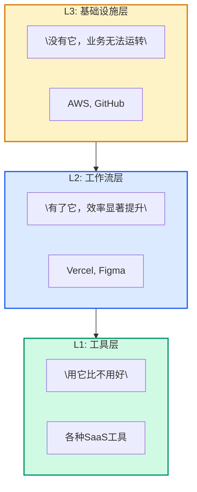

> **TL;DR**
> 
> 技术平台的演化遵循可识别的模式：工具 → 工作流 → 基础设施。本文提出"平台演化三阶段模型"，分析GitHub、Vercel、Stripe等案例，揭示平台从"可选"到"必需"的跃迁逻辑。关键洞察：识别平台所处的演化阶段，比评估其当前功能更重要。

---

## 一、Hook：一个历史规律

观察过去20年的技术平台：
- AWS：从"租服务器"到"云计算基础设施"
- Stripe：从"支付API"到"商业基础设施"
- GitHub：从"代码托管"到"软件开发基础设施"

**共同规律**：成功的平台都完成了从"工具"到"基础设施"的跃迁。

**关键问题**：这种跃迁是可预测的吗？能否被加速或复制？

---

## 二、问题本质：平台认知的层级差异

### 三层平台认知

### 认知错位的代价

**企业视角**：
- 把L3平台当L1工具管理 → 低估依赖风险
- 把L1工具当L3基础设施投入 → 资源浪费

**平台视角**：
- 在L1阶段做L3的事 → 过早复杂化
- 在L3阶段做L1的事 → 增长停滞

---

## 三、现有分析的问题：为什么战略分析失效

### 传统战略分析的局限

| 分析维度 | 问题 | 为什么不够 |
|----------|------|------------|
| 功能对比 | 静态快照 | 平台价值不在功能，在生态 |
| 市场份额 | 滞后指标 | 不能预测跃迁时机 |
| 财务数据 | 结果而非原因 | 不能解释演化逻辑 |
| 竞品分析 | 零和思维 | 平台竞争往往是正和 |

**根本问题**：传统分析回答"平台现在怎么样"，但不回答"平台将向何处演化"。

---

## 四、核心模型：平台演化三阶段

### 阶段1：工具化（Tooling）

**特征**：
- 解决单点问题
- 可替代性强
- 用户认知："用它更好"
- 定价：按功能付费

**关键任务**：
- 找到PMF（产品市场契合）
- 建立核心用户群
- 验证价值假设

**风险**：
- 功能被大厂集成
- 用户迁移成本低
- 价格战

**案例**：
- 早期Heroku："比自建服务器方便"
- 早期Stripe："比PayPal API好用"

---

### 阶段2：工作流嵌入（Workflow Embedding）

**特征**：
- 成为工作流程的一部分
- 迁移成本上升
- 用户认知："效率依赖"
- 定价：按价值付费

**关键任务**：
- 深度集成到用户工作流
- 建立网络效应
- 形成数据护城河

**信号**：
- 日活/月活比>50%
- 功能使用深度增加
- 用户主动推荐

**案例**：
- Vercel：从"部署工具"到"前端工作流"
- Figma：从"设计工具"到"协作工作流"

---

### 阶段3：基础设施化（Infrastructure）

**特征**：
- 成为行业标准
- 迁移成本极高
- 用户认知："没有它无法工作"
- 定价：按用量/规模付费

**关键任务**：
- 成为生态中心
- 建立平台标准
- 培育第三方生态

**信号**：
- 被竞争对手模仿
- 成为求职技能要求
- 第三方工具围绕其构建

**案例**：
- AWS：云计算基础设施
- GitHub：软件开发基础设施
- Kubernetes：容器编排基础设施

---

## 五、实战拆解：识别平台阶段

### 维度1：用户依赖度

| 阶段 | 问题 | 典型回答 |
|------|------|----------|
| L1 | "如果明天不能用，会怎样？" | "有点麻烦，但可以找替代" |
| L2 | "如果明天不能用，会怎样？" | "效率会下降很多" |
| L3 | "如果明天不能用，会怎样？" | "业务无法正常运转" |

---

### 维度2：迁移成本

| 阶段 | 迁移成本 | 主要构成 |
|------|----------|----------|
| L1 | 低 | 学习成本 |
| L2 | 中 | 数据迁移 + 工作流重构 |
| L3 | 高 | 系统重构 + 团队技能 + 生态依赖 |

---

### 维度3：生态地位

| 阶段 | 生态角色 | 关系 |
|------|----------|------|
| L1 | 参与者 | 被集成 |
| L2 | 连接者 | 集成与被集成 |
| L3 | 中心节点 | 被围绕 |

---

### 应用：GitHub的演化分析

**当前阶段判断**：
- 用户依赖度：L3（"没有GitHub无法工作"）
- 迁移成本：L3（生态锁定）
- 生态地位：L3（中心节点）

**结论**：GitHub已完成从L1→L2→L3的跃迁，当前处于"基础设施化"阶段。

**战略启示**：
- 维护基础设施稳定性比新功能更重要
- 生态培育比用户获取更重要
- 标准制定比功能竞争更重要

---

## 六、上升到原则：平台演化规律

### 原则1：跃迁不可逆原则

**核心**：
一旦完成阶段跃迁，不会退回。

**原因**：
- 用户依赖形成
- 生态锁定建立
- 竞争格局固化

**启示**：
- 在L1阶段不要过早做L3的事
- 在L2阶段要全力冲刺L3
- 在L3阶段要维护基础设施地位

---

### 原则2：临界点效应

**核心**：
阶段跃迁不是渐进的，而是临界点的突变。

**信号**：
- 用户增长从线性变为指数
- 从"被集成"变为"被围绕"
- 从"成本中心"变为"利润中心"

**启示**：
- 识别临界点前兆比优化当前更重要
- 在临界点前后资源投入策略完全不同

---

### 原则3：生态位竞争原则

**核心**：
同一生态位只能有一个主导者。

**应用**：
- L1阶段：差异化竞争
- L2阶段：速度竞争（谁先嵌入工作流）
- L3阶段：标准竞争（谁定义基础设施）

---

## 七、未来判断：AI平台演化趋势

### 预测1：AI编程工具的收敛（6-12月）

**趋势**：
- 从碎片化工具到标准化基础设施
- IDE/终端边界模糊
- 统一的AI编程接口标准出现

**影响**：
- 当前的工具竞争将让位于平台竞争
- 生态锁定将加速形成

---

### 预测2：AI Agent平台化（12-18月）

**趋势**：
- 从单点Agent到Agent平台
- 从人工编排到自动编排
- 从封闭到开放生态

**影响**：
- 第一批AI Agent基础设施平台将出现
- 开发者技能要求重构

---

### 预测3：AI基础设施分层（18-24月）

**趋势**：
- 模型层：commoditized
- 编排层：差异化竞争
- 应用层：垂直整合

**影响**：
- 平台价值从模型能力转向编排能力
- 垂直领域AI基础设施崛起

---

## 八、可执行清单

### 企业视角：评估你的平台依赖

- [ ] 列出所有关键平台工具
- [ ] 评估每个平台的演化阶段（L1/L2/L3）
- [ ] 识别L3平台依赖风险
- [ ] 制定多供应商/自研策略

### 平台视角：加速你的跃迁

- [ ] 明确当前阶段（L1/L2/L3）
- [ ] 识别阶段跃迁的关键任务
- [ ] 设定阶段跃迁的时间目标
- [ ] 资源投入与阶段匹配

### 投资者视角：评估平台价值

- [ ] 识别平台所处阶段
- [ ] 评估阶段跃迁的可能性
- [ ] 判断临界点到来的时机
- [ ] 估值与阶段匹配

---

## 结语

平台演化的核心不是功能竞争，而是阶段跃迁。

识别平台所处的演化阶段，比评估其当前功能更重要。

**对于企业**：管理好L3平台依赖风险。
**对于平台**：聚焦阶段跃迁的关键任务。
**对于投资者**：识别临界点到来的信号。

---

## 参考与延伸阅读

- [Crossing the Chasm](https://en.wikipedia.org/wiki/Crossing_the_Chasm) - Geoffrey Moore
- [Platform Revolution](https://www.platformrevolution.com/) - Parker, Van Alstyne, Choudary
- [The Lean Startup](https://en.wikipedia.org/wiki/The_Lean_Startup) - Eric Ries

---

*这篇文章的演化模型可在1年后仍被引用。具体平台会变，但演化逻辑不变。*

*发布于 [postcodeengineering.com](/)*
