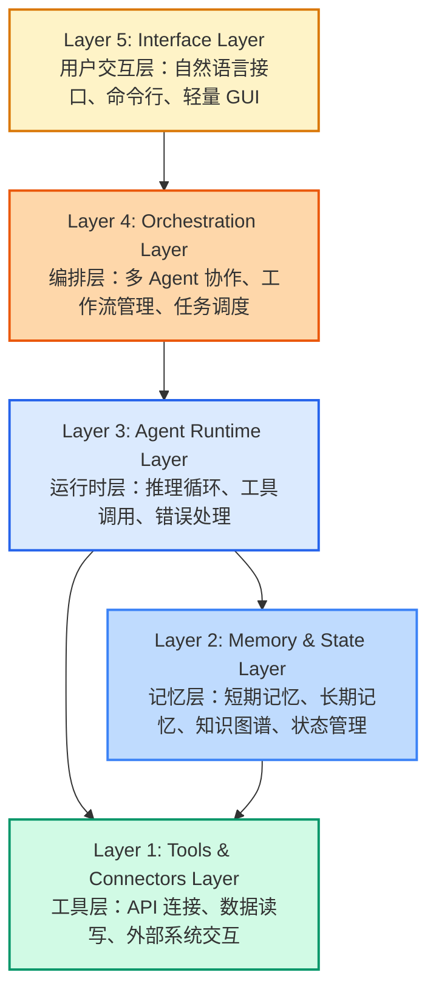
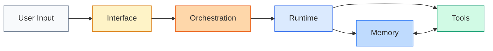
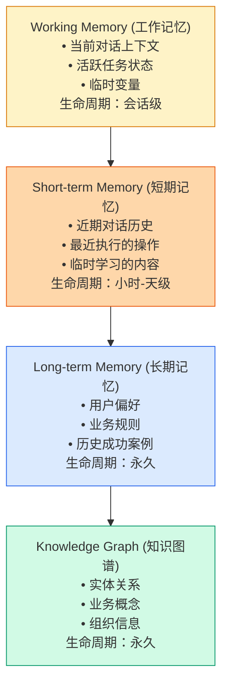
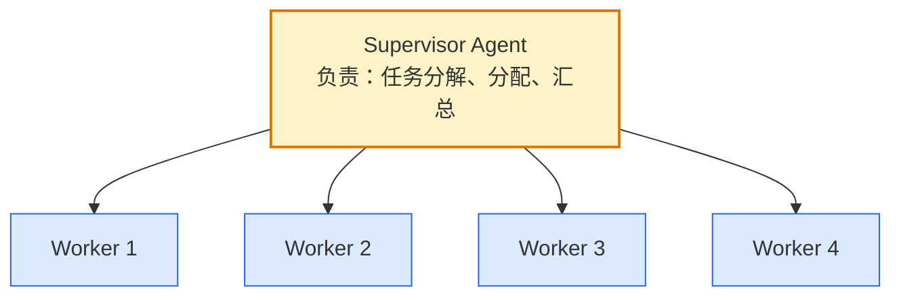
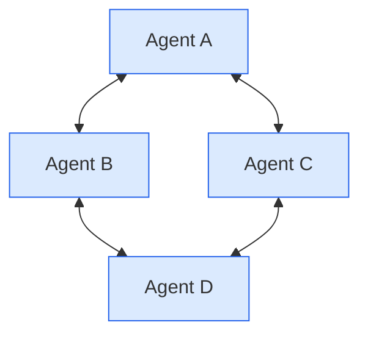
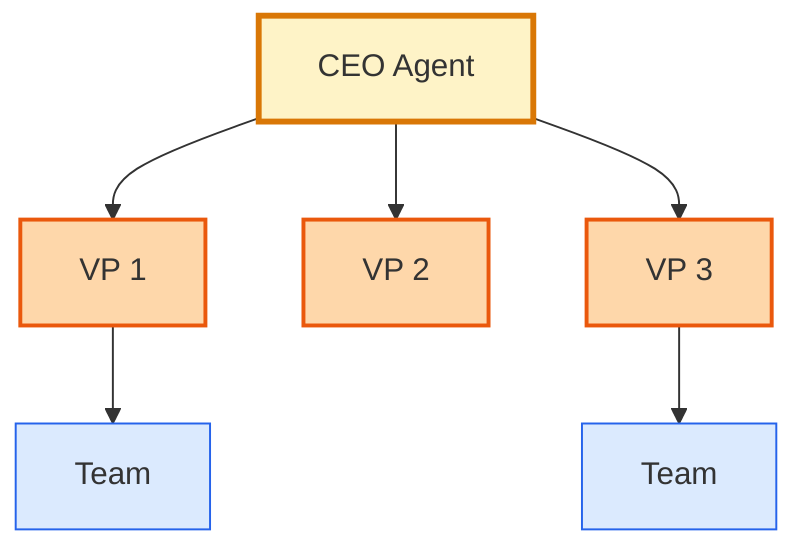

*"架构决定上限，工程决定下限。"
*

---

> **TL;DR**
>
> Agent OS 的五层架构（Tools → Memory → Runtime → Orchestration → Interface）提供了一个可落地的工程框架。每一层有明确职责边界：Tools 连接外部世界，Memory 存储知识经验，Runtime 负责推理行动，Orchestration 管理协作调度，Interface 处理人机交互。关键洞察：好的架构决定上限，扎实的工程实现决定下限。

---

## 📋 本文结构

- [为什么需要分层架构？](#为什么需要分层架构)
- [五层架构全景图](#五层架构全景图)
- [Layer 1: Tools & Connectors](#layer-1-tools--connectors)
- [Layer 2: Memory & State](#layer-2-memory--state)
- [Layer 3: Agent Runtime](#layer-3-agent-runtime)
- [Layer 4: Orchestration](#layer-4-orchestration)
- [Layer 5: Interface](#layer-5-interface)
- [实现路径：从 MVP 到生产](#实现路径从-mvp-到生产)
- [写在最后](#写在最后)

---

## 为什么需要分层架构？

### Agent 系统的复杂性

构建一个生产级的 Agent 系统，你需要处理：

- **外部连接**：API、数据库、第三方系统
- **记忆管理**：短期记忆、长期记忆、知识图谱
- **推理能力**：规划、执行、反思、学习
- **多 Agent 协作**：任务分配、通信、冲突解决
- **用户交互**：自然语言理解、界面呈现

如果把这些都耦合在一起，系统会变得：
- 难以维护
- 难以扩展
- 难以调试
- 难以测试

### 分层架构的优势

| 优势 | 说明 |
|------|------|
| **关注点分离** | 每层只解决一类问题 |
| **可替换性** | 可以独立升级某一层的技术栈 |
| **可测试性** | 每层可以独立测试 |
| **团队协作** | 不同团队可以并行开发不同层 |

---

## 五层架构全景图



**数据流向：**



---

## Layer 1: Tools & Connectors

### 职责

- 连接外部系统（CRM、ERP、数据库、API）
- 执行具体操作（读取、写入、调用）
- 处理认证、授权、限流
- 数据格式转换

### 核心组件

**1. Connector Registry**

管理所有可用的连接器和工具：

```python
class ConnectorRegistry:
    def __init__(self):
        self.connectors = {}
    
    def register(self, name: str, connector: Connector):
        self.connectors[name] = connector
    
    def get(self, name: str) -> Connector:
        return self.connectors.get(name)
    
    def list_available(self) -> List[str]:
        return list(self.connectors.keys())
```

**2. Base Connector 接口**

```python
class BaseConnector(ABC):
    @abstractmethod
    def authenticate(self, credentials: dict) -> bool:
        """认证连接"""
        pass
    
    @abstractmethod
    def execute(self, action: str, params: dict) -> Result:
        """执行操作"""
        pass
    
    @abstractmethod
    def get_schema(self) -> Schema:
        """获取数据结构"""
        pass
```

**3. 具体 Connector 示例**

```python
class SalesforceConnector(BaseConnector):
    def execute(self, action: str, params: dict) -> Result:
        if action == "create_lead":
            return self.create_lead(params)
        elif action == "update_opportunity":
            return self.update_opportunity(params)
        # ...
    
    def create_lead(self, params: dict) -> Result:
        # 调用 Salesforce API
        response = self.client.Lead.create(params)
        return Result(success=True, data=response)
```

### 关键技术决策

| 决策 | 选项 | 建议 |
|------|------|------|
| **协议支持** | REST、GraphQL、gRPC | 优先 REST，GraphQL 用于复杂查询 |
| **认证方式** | OAuth 2.0、API Key、JWT | 根据外部系统选择 |
| **错误处理** | 重试、熔断、降级 | 必须实现熔断器 |
| **限流** | 令牌桶、漏桶 | API 调用必须限流 |

### 实践建议

1. **工具描述**：每个 connector 需要提供自然语言描述，让 Agent 知道它能做什么
2. **参数验证**：严格的输入验证，防止错误参数导致的问题
3. **幂等性**：关键操作必须是幂等的，防止重复执行
4. **审计日志**：所有操作都要记录，便于调试和合规

---

## Layer 2: Memory & State

### 职责

- 存储和管理 Agent 的记忆
- 维护对话上下文
- 持久化用户偏好和业务知识
- 管理 Agent 的状态

### 记忆类型



### 实现方案

**1. Working Memory**

```python
class WorkingMemory:
    """工作记忆：当前会话的上下文"""
    
    def __init__(self, session_id: str):
        self.session_id = session_id
        self.context_window = []  # 最近 N 轮对话
        self.active_tasks = {}    # 当前执行的任务
        self.variables = {}       # 临时变量
    
    def add_to_context(self, message: Message):
        self.context_window.append(message)
        # 保持窗口大小
        if len(self.context_window) > MAX_CONTEXT_SIZE:
            self.context_window.pop(0)
    
    def get_context(self) -> List[Message]:
        return self.context_window
```

**2. Short-term Memory**

使用 Vector DB 存储：

```python
class ShortTermMemory:
    """短期记忆：可检索的近期信息"""
    
    def __init__(self, vector_store: VectorStore):
        self.vector_store = vector_store
    
    def store(self, content: str, metadata: dict):
        """存储记忆"""
        embedding = self.embed(content)
        self.vector_store.add(
            id=generate_id(),
            embedding=embedding,
            content=content,
            metadata=metadata,
            timestamp=now()
        )
    
    def retrieve(self, query: str, k: int = 5) -> List[Memory]:
        """检索相关记忆"""
        query_embedding = self.embed(query)
        return self.vector_store.search(
            query_embedding, 
            k=k,
            filter={"timestamp": {">": now() - timedelta(days=7)}}
        )
```

**3. Long-term Memory**

使用关系型数据库 + 缓存：

```python
class LongTermMemory:
    """长期记忆：用户偏好和业务知识"""
    
    def __init__(self, db: Database, cache: Cache):
        self.db = db
        self.cache = cache
    
    def get_user_preference(self, user_id: str, key: str):
        # 先查缓存
        cached = self.cache.get(f"user:{user_id}:pref:{key}")
        if cached:
            return cached
        
        # 再查数据库
        value = self.db.query(
            "SELECT value FROM user_preferences WHERE user_id = ? AND key = ?",
            user_id, key
        )
        
        # 写入缓存
        self.cache.set(f"user:{user_id}:pref:{key}", value)
        return value
    
    def update_user_preference(self, user_id: str, key: str, value: any):
        self.db.execute(
            "INSERT OR REPLACE INTO user_preferences (user_id, key, value) VALUES (?, ?, ?)",
            user_id, key, value
        )
        self.cache.set(f"user:{user_id}:pref:{key}", value)
```

**4. Knowledge Graph**

使用图数据库：

```python
class KnowledgeGraph:
    """知识图谱：实体和关系"""
    
    def __init__(self, graph_db: GraphDatabase):
        self.graph = graph_db
    
    def add_entity(self, entity: Entity):
        """添加实体"""
        self.graph.run("""
            MERGE (e:Entity {id: $id})
            SET e.name = $name, e.type = $type
        """, id=entity.id, name=entity.name, type=entity.type)
    
    def add_relation(self, from_id: str, relation: str, to_id: str):
        """添加关系
        
        注意：Cypher 不支持参数化关系类型，需要使用字符串拼接或 APOC
        """
        # 方法 1：使用字符串拼接（注意防范注入）
        query = f"""
            MATCH (a:Entity {{id: $from_id}})
            MATCH (b:Entity {{id: $to_id}})
            MERGE (a)-[r:{relation}]->(b)
        """
        self.graph.run(query, from_id=from_id, to_id=to_id)
        
        # 方法 2：使用 APOC（如果可用）
        # self.graph.run("""
        #     MATCH (a:Entity {id: $from_id})
        #     MATCH (b:Entity {id: $to_id})
        #     CALL apoc.merge.relationship(a, $relation, {}, {}, b) YIELD rel
        #     RETURN rel
        # """, from_id=from_id, to_id=to_id, relation=relation)
    
    def query(self, start_entity: str, relation_type: str, depth: int = 2):
        """查询关系
        
        注意：Cypher 不支持参数化可变长度关系，需要使用字符串拼接
        """
        query = f"""
            MATCH path = (start:Entity {{id: $start}})-[:{relation_type}*1..{depth}]-(related)
            RETURN related, path
        """
        return self.graph.run(query, start=start_entity)
```

> ⚠️ **重要提示**：上述代码中的字符串拼接存在 Cypher 注入风险。生产环境应该：
> 1. 对 `relation` 参数进行白名单验证（只允许预定义的关系类型）
> 2. 或使用 APOC 库的 `apoc.merge.relationship` 和 `apoc.path.expandConfig`
> 3. 参考 [Neo4j 官方安全指南](https://neo4j.com/docs/cypher-manual/current/security/)

### 关键技术决策

| 组件 | 技术选型 | 理由 |
|------|----------|------|
| **Vector DB** | Pinecone / Milvus / PGVector | 根据规模和成本选择 |
| **图数据库** | Neo4j / Dgraph / Amazon Neptune | Neo4j 生态最成熟 |
| **缓存** | Redis / Memcached | Redis 支持更多数据结构 |
| **主数据库** | PostgreSQL / MySQL | 根据团队熟悉度选择 |

---

## Layer 3: Agent Runtime

### 职责

- 管理 Agent 的生命周期
- 执行推理循环（Observation → Thought → Action）
- 调用工具并处理结果
- 处理错误和异常
- 管理上下文窗口

### 核心组件

**1. ReAct Loop（推理-行动循环）**

```python
class ReActRuntime:
    """
    ReAct: Reasoning and Acting
    思考 → 行动 → 观察 → 重复
    """
    
    def __init__(self, llm: LLM, tools: ToolRegistry, memory: MemorySystem):
        self.llm = llm
        self.tools = tools
        self.memory = memory
    
    def run(self, task: str, max_iterations: int = 10) -> Result:
        context = self.memory.get_context()
        
        for i in range(max_iterations):
            # 1. 思考（Reasoning）
            thought = self.think(task, context)
            
            # 2. 决定行动（Action Decision）
            action = self.decide_action(thought)
            
            if action.type == "FINISH":
                return Result(success=True, output=action.output)
            
            # 3. 执行行动（Acting）
            observation = self.execute_action(action)
            
            # 4. 更新上下文
            context.add_step(thought, action, observation)
            
            # 5. 检查是否需要人工介入
            if self.needs_human_intervention(context):
                return Result(
                    success=False, 
                    status="NEEDS_APPROVAL",
                    context=context
                )
        
        return Result(success=False, status="MAX_ITERATIONS_REACHED")
    
    def think(self, task: str, context: Context) -> Thought:
        """让 LLM 思考下一步"""
        prompt = self.build_thought_prompt(task, context)
        return self.llm.generate(prompt)
    
    def decide_action(self, thought: Thought) -> Action:
        """根据思考决定行动"""
        # 解析 LLM 输出，确定是调用工具还是完成任务
        pass
    
    def execute_action(self, action: Action) -> Observation:
        """执行行动并观察结果"""
        if action.tool:
            tool = self.tools.get(action.tool)
            return tool.execute(action.params)
        return Observation(content="No tool called")
```

**2. Plan-and-Execute（计划-执行模式）**

适合复杂多步骤任务：

```python
class PlanAndExecuteRuntime:
    """
    先制定计划，再逐步执行
    """
    
    def run(self, task: str) -> Result:
        # 1. 制定计划
        plan = self.create_plan(task)
        
        # 2. 执行计划
        for step in plan.steps:
            result = self.execute_step(step)
            
            if not result.success:
                # 重新规划
                plan = self.replan(plan, step, result)
        
        return Result(success=True, output=self.compile_results())
    
    def create_plan(self, task: str) -> Plan:
        """让 LLM 制定执行计划"""
        prompt = f"""
        Task: {task}
        
        Create a step-by-step plan to accomplish this task.
        Available tools: {self.tools.list_available()}
        
        Plan:
        """
        plan_text = self.llm.generate(prompt)
        return self.parse_plan(plan_text)
```

**3. Reflection（反思改进）**

```python
class ReflectionCapability:
    """
    让 Agent 能够反思自己的错误并改进
    """
    
    def reflect(self, task: str, actions: List[Action], result: Result) -> Lessons:
        """反思执行过程"""
        prompt = f"""
        Task: {task}
        Actions taken: {actions}
        Result: {result}
        
        Analyze what went well and what could be improved.
        Provide specific lessons for future similar tasks.
        """
        reflection = self.llm.generate(prompt)
        return self.parse_lessons(reflection)
    
    def apply_lessons(self, lessons: Lessons, future_tasks: List[str]):
        """将经验教训应用到未来任务"""
        for task in future_tasks:
            if self.is_similar(task, lessons.original_task):
                task.add_context(f"Previous lesson: {lessons.summary}")
```

### 关键技术决策

| 决策 | 建议 |
|------|------|
| **Runtime 模式** | 从 ReAct 开始，复杂任务用 Plan-and-Execute |
| **迭代限制** | 默认 10 次，防止无限循环 |
| **错误处理** | 区分可恢复错误和致命错误 |
| **人工介入** | 高风险操作必须人工确认 |
| **超时控制** | 单次 LLM 调用 < 30s，整体任务 < 5min |

---

## Layer 4: Orchestration

### 职责

- 管理多个 Agent 的协作
- 任务分解和分配
- 处理 Agent 之间的通信
- 解决冲突和竞争条件
- 监控执行进度

### 多 Agent 架构模式

> 📌 **选择指南**：三种模式各有适用场景，关键决策因素是任务复杂度、Agent 专业化程度和通信频率。

**模式 1：主管-工作者（Supervisor-Workers）**



**适用场景**：
- 任务可以清晰分解为独立子任务
- 需要中心节点进行质量控制
- Worker Agent 之间不需要频繁通信

**示例**：内容生成流水线（研究员 → 写手 → 编辑 → 发布员）

**优缺点**：
- ✅ 结构清晰，易于监控
- ✅ 单点故障风险可控（Supervisor 可以重启）
- ❌ Supervisor 可能成为瓶颈
- ❌ Worker 间通信需通过 Supervisor 转发

---

**模式 2：平等协作（Peer-to-Peer）**



**适用场景**：
- Agent 需要频繁协商和信息交换
- 没有明显的任务分解结构
- 各 Agent 地位平等（如专家会诊）

**示例**：多领域专家协作诊断（安全专家 + 性能专家 + 业务专家共同分析系统问题）

**优缺点**：
- ✅ 通信效率高（直接对话）
- ✅ 适合复杂协商场景
- ❌ 结构复杂，难以调试
- ❌ 可能出现循环依赖或死锁

---

**模式 3：层级结构（Hierarchy）**



**适用场景**：
- 组织架构本身具有层级特性
- 需要多级决策和汇总
- 任务规模大，需要分层管理

**示例**：企业级自动化（战略层 → 部门层 → 执行层）

**优缺点**：
- ✅ 符合人类组织直觉
- ✅ 可扩展性强（每层可以横向扩展）
- ❌ 延迟较高（需要层层上报）
- ❌ 信息可能在传递中失真

---

**决策矩阵**

| 场景特征 | 推荐模式 | 理由 |
|----------|----------|------|
| 任务可分解为独立子任务 | **Supervisor-Workers** | 结构清晰，易于监控 |
| Agent 需要频繁协商 | **Peer-to-Peer** | 直接通信，效率高 |
| 模拟企业组织架构 | **Hierarchy** | 符合直觉，可扩展 |
| 简单并行处理 | **Supervisor-Workers** | 实现简单，易于调试 |
| 复杂问题多专家会诊 | **Peer-to-Peer** | 平等协商，集思广益 |
| 跨部门大型企业流程 | **Hierarchy** | 分层管理，责任清晰 |

**混合使用**

实际系统中 often 需要混合使用多种模式：

```
Hierarchy（顶层）
    └── CEO Agent
        ├── VP1（Supervisor-Workers）
        │       └── 管理 3 个 Worker Agent
        ├── VP2（Peer-to-Peer）
        │       └── 与 2 个平级 Agent 协作
        └── VP3（Hierarchy）
                └── 继续向下分层
```

### 实现方案

```python
class OrchestrationEngine:
    """
    多 Agent 编排引擎
    """
    
    def __init__(self):
        self.agents = {}
        self.message_bus = MessageBus()
        self.task_queue = TaskQueue()
    
    def register_agent(self, agent_id: str, agent: Agent):
        """注册 Agent"""
        self.agents[agent_id] = agent
        agent.set_message_bus(self.message_bus)
    
    def execute_workflow(self, workflow: Workflow) -> Result:
        """执行工作流"""
        execution_plan = self.create_execution_plan(workflow)
        
        for step in execution_plan:
            if step.type == "SINGLE":
                result = self.execute_single_agent_step(step)
            elif step.type == "PARALLEL":
                result = self.execute_parallel_step(step)
            elif step.type == "CONDITIONAL":
                result = self.execute_conditional_step(step)
            
            if not result.success:
                return self.handle_failure(workflow, step, result)
        
        return Result(success=True)
    
    def execute_parallel_step(self, step: Step) -> Result:
        """并行执行多个 Agent"""
        futures = []
        for agent_id in step.agents:
            agent = self.agents[agent_id]
            future = self.executor.submit(agent.run, step.subtask)
            futures.append((agent_id, future))
        
        # 收集结果
        results = {}
        for agent_id, future in futures:
            results[agent_id] = future.result(timeout=step.timeout)
        
        # 汇总结果
        return self.aggregate_results(results)
    
    def handle_agent_communication(self, from_agent: str, to_agent: str, message: Message):
        """处理 Agent 间通信"""
        if to_agent == "BROADCAST":
            # 广播给所有 Agent
            for agent_id, agent in self.agents.items():
                if agent_id != from_agent:
                    agent.receive_message(message)
        else:
            # 单播
            self.agents[to_agent].receive_message(message)
```

---

## Layer 5: Interface

### 职责

- 接收用户输入（自然语言、命令、点击）
- 展示 Agent 的输出和状态
- 提供人工介入的入口
- 管理用户会话

### 界面形式

**1. 对话式界面（Chat Interface）**

```
┌─────────────────────────────┐
│  💬 Agent Assistant         │
├─────────────────────────────┤
│                             │
│  Agent: 你好！我是你的销售   │
│  助手。今天需要我做什么？    │
│                             │
│  ─────────────────────────  │
│  User: 帮我看看这周要跟进    │
│  的客户                      │
│                             │
│  Agent: 找到 5 个客户需要    │
│  跟进：                      │
│  1. Acme Corp - 合同待签     │
│  2. ...                      │
│                             │
│  [帮我起草邮件] [安排会议]   │
│                             │
├─────────────────────────────┤
│ [输入消息...]        [发送] │
└─────────────────────────────┘
```

**2. 命令式界面（Command Interface）**

```
> /find leads high-value not-contacted 7d
找到 12 个高价值客户，7 天内未联系

> /draft follow-up email
已生成 3 个版本的跟进邮件

> /schedule meeting tomorrow 2pm
已发送会议邀请
```

**3. 嵌入式界面（Embedded Widget）**

在现有 SaaS 界面中添加 AI 助手按钮，点击后弹出对话窗口。

### 关键工程实现

**1. 流式输出（Streaming）**

Agent 的思考过程和输出应该实时展示给用户，而不是等全部完成：

```python
from fastapi import FastAPI
from fastapi.responses import StreamingResponse
import asyncio

app = FastAPI()

@app.post("/chat")
async def chat_stream(message: str):
    async def event_generator():
        # 发送 Agent 的思考过程
        async for thought in agent.think_stream(message):
            yield f"data: {json.dumps({'type': 'thought', 'content': thought})}\n\n"
        
        # 发送工具调用
        yield f"data: {json.dumps({'type': 'action', 'tool': 'search_leads', 'status': 'started'})}\n\n"
        result = await agent.execute_action()
        yield f"data: {json.dumps({'type': 'action', 'tool': 'search_leads', 'status': 'completed', 'result': result})}\n\n"
        
        # 发送最终结果
        yield f"data: {json.dumps({'type': 'final', 'content': result.summary})}\n\n"
    
    return StreamingResponse(
        event_generator(),
        media_type="text/event-stream"
    )
```

**前端实现（SSE）：**

```javascript
const eventSource = new EventSource('/chat?message=...');

eventSource.onmessage = (event) => {
    const data = JSON.parse(event.data);
    
    switch(data.type) {
        case 'thought':
            showThinkingBubble(data.content);
            break;
        case 'action':
            updateActionStatus(data.tool, data.status);
            break;
        case 'final':
            displayFinalResult(data.content);
            eventSource.close();
            break;
    }
};
```

**2. 中途打断（Interruption）**

用户应该能随时停止 Agent 的执行：

```python
class InterruptibleAgent:
    def __init__(self):
        self.cancel_token = asyncio.Event()
    
    async def run(self, task: str) -> Result:
        for step in self.plan_steps(task):
            # 检查是否被取消
            if self.cancel_token.is_set():
                return Result(
                    status="CANCELLED",
                    partial_results=self.collect_partial_results()
                )
            
            await self.execute_step(step)
    
    def cancel(self):
        """用户点击停止按钮时调用"""
        self.cancel_token.set()
```

**API 设计：**

```python
@app.post("/chat/{session_id}/cancel")
async def cancel_agent(session_id: str):
    agent = get_agent(session_id)
    agent.cancel()
    return {"status": "cancelled"}
```

**3. 多模态输出**

Agent 的输出不应该只有文本：

```python
class MultiModalResponse:
    def __init__(self):
        self.blocks = []
    
    def add_text(self, text: str):
        self.blocks.append({"type": "text", "content": text})
    
    def add_table(self, headers: List[str], rows: List[List]):
        self.blocks.append({
            "type": "table",
            "headers": headers,
            "rows": rows
        })
    
    def add_chart(self, chart_type: str, data: dict):
        self.blocks.append({
            "type": "chart",
            "chart_type": chart_type,  # line, bar, pie
            "data": data
        })
    
    def add_code(self, code: str, language: str):
        self.blocks.append({
            "type": "code",
            "language": language,
            "content": code
        })
    
    def add_actions(self, actions: List[Action]):
        """添加可点击的操作按钮"""
        self.blocks.append({
            "type": "actions",
            "actions": [
                {"label": a.label, "action_id": a.id, "params": a.params}
                for a in actions
            ]
        })
```

**前端渲染：**

```jsx
function MessageBlock({ block }) {
    switch(block.type) {
        case 'text':
            return <Markdown content={block.content} />;
        case 'table':
            return <DataTable headers={block.headers} rows={block.rows} />;
        case 'chart':
            return <Chart type={block.chart_type} data={block.data} />;
        case 'code':
            return <CodeBlock code={block.content} language={block.language} />;
        case 'actions':
            return <ActionButtons actions={block.actions} onAction={handleAction} />;
    }
}
```

**4. 人工介入点（Human-in-the-loop）**

关键决策点必须让用户确认：

```python
class AgentWithApproval:
    async def execute_high_risk_action(self, action: Action) -> Result:
        # 发送审批请求到界面
        approval_request = await self.request_approval(
            action=action,
            context=self.get_current_context(),
            timeout=300  # 5分钟超时
        )
        
        if approval_request.status == "APPROVED":
            return await self.execute(action)
        elif approval_request.status == "REJECTED":
            return Result(status="REJECTED", reason=approval_request.reason)
        else:  # TIMEOUT
            return Result(status="TIMEOUT", fallback_action=self.get_safe_fallback())
```

### 关键设计原则

**1. 渐进式披露**
- 默认显示简洁结果
- 可展开查看详细过程
- 保留手动调整入口

**2. 实时反馈**
- 显示 Agent 正在思考（打字机效果）
- 展示执行进度（进度条或步骤指示器）
- 允许中途取消

**3. 容错设计**
- Agent 失败时提供重试选项
- 显示失败原因（技术细节可折叠）
- 提供人工接管的快捷入口

---

## 与现有框架的关系

Agent OS 的五层架构与现有框架的关系：

| 框架 | 定位 | 与 Agent OS 的关系 |
|------|------|-------------------|
| **LangChain** | 开发框架 | LangChain 提供 Layer 1-3 的组件（Tools、Memory、Runtime），Agent OS 提供更完整的分层架构和 Layer 4-5 的参考实现 |
| **AutoGen** | 多 Agent 框架 | AutoGen 专注于 Layer 4（Orchestration），Agent OS 的编排层可以借鉴其 Conversation Patterns |
| **CrewAI** | 角色扮演框架 | CrewAI 提供基于角色的 Agent 团队（Layer 4 的一种实现），Agent OS 提供更通用的编排抽象 |
| **LlamaIndex** | 数据检索框架 | LlamaIndex 专注于 Layer 2（Memory 的检索部分），Agent OS 将其作为 Memory 层的一个组件 |

### 如何选择

**使用现有框架（推荐大多数团队）：**
- 快速原型开发
- 团队没有专门的 Agent 平台团队
- 需要社区支持和生态

**自建 Agent OS（适合大型团队）：**
- 需要深度定制每一层
- 有专门的 Agent 平台团队
- 业务场景与现有框架假设不匹配

**渐进式策略（最务实）：**
1. 先用 LangChain / AutoGen 搭建 MVP
2. 在使用过程中识别框架的局限性
3. 逐步替换有局限的层（通常是 Memory 和 Interface）
4. 最终形成自己的 Agent OS

---

## 实现路径：从 MVP 到生产

### Phase 1: MVP（1-2 个月）

**目标**：验证核心概念

**技术栈：**
- Layer 1：3-5 个核心 Connector
- Layer 2：简单数据库存储上下文
- Layer 3：ReAct Runtime + OpenAI GPT-4
- Layer 4：单 Agent，无需编排
- Layer 5：简单 Chat 界面

**关键指标：**
- 能完成 3-5 个核心场景
- 端到端响应时间 < 10s
- 任务成功率（用户认为结果可用）> 70%

### Phase 2: 产品化（3-6 个月）

**目标**：内部或种子客户试用

**增强：**
- Layer 2：添加 Vector DB 支持长期记忆
- Layer 3：添加错误处理和人工介入
- Layer 4：支持 2-3 个 Agent 协作
- Layer 5：添加命令界面和嵌入式 Widget

**关键指标：**
- 覆盖 80% 核心场景
- 端到端响应时间 < 5s
- 任务成功率 > 85%
- 用户满意度（1-5 分）> 4 分

### Phase 3: 生产级（6-12 个月）

**目标**：大规模商用

**完善：**
- 所有层都达到生产级标准
- 完整的监控和可观测性
- 安全合规（SOC2、GDPR）
- 多租户支持

**关键指标：**
- 可用性 99.9%
- 端到端响应时间 P95 < 3s
- 任务成功率 > 90%
- 支持 1000+ 并发会话

> 💡 **关于"任务成功率"的定义**：指用户提交任务后，Agent 生成的结果被用户接受（无需重大修改即可使用）的比例。不同于传统的"准确率"，因为 Agent 任务往往没有唯一正确答案。

---

## 写在最后

**Agent OS 的五层架构不是一个理论模型，而是可以落地的工程方案。**

每一层都有明确的职责边界：
- **Tools**：连接外部世界
- **Memory**：存储知识和经验
- **Runtime**：思考和行动
- **Orchestration**：协作和调度
- **Interface**：与人交互

**关键成功因素：**

1. **从简单开始**：不要试图一次性实现所有功能
2. **数据质量优先**：Agent 的智能取决于数据的质量
3. **人工介入机制**：永远给用户控制的权利
4. **持续迭代**：Agent 需要不断学习和改进

**最后的话：**

> 架构决定上限，工程决定下限。
> 
> 好的 Agent OS 架构可以让你走得更远，但只有扎实的工程实现才能让你走得稳。

---

## 📚 延伸阅读

**本系列文章**

- [Agent OS：SaaS 之后的下一个软件形态](/agent-os-future-of-software/)
- [为什么你的 SaaS 产品需要 Agent 层？](/why-your-saas-needs-agent-layer/)
- [从 Human-driven 到 Agent-driven](/human-driven-to-agent-driven/)
- [Agent 的记忆系统设计](/agent-memory-system-design/)
- [Multi-Agent 协作](/multi-agent-collaboration/)

**外部资源**

- [ReAct: Synergizing Reasoning and Acting in Language Models](https://arxiv.google.com/abs/2210.03629)
- [LangChain Architecture](https://python.langchain.com/docs/modules/)
- [Building LLM Systems](https://hamel.dev/blog/posts/llm-systems/)

---

*Agent OS 系列 - 第 4 篇*
*由 @postcodeeng 整理发布*

*Published on 2026-03-31*
*阅读时间：约 15 分钟*

*下一篇预告：《Agent 的记忆系统设计》*
