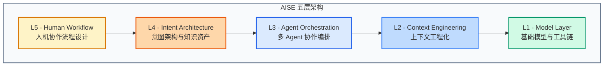

## 👋 你好，我是 @postcodeeng

> **探索 AI-Native 软件工程的边界**

我是一名独立研究者，专注于 **AISE（AI-Native Software Engineering）** 和 **Agent OS** 架构设计。

---

## 🎯 核心理念

### Post-Code 的含义

**Post-Code** 不是"没有代码"，而是**超越代码**。

当 AI 可以生成、理解、重构代码时，软件工程的核心竞争力正在转移：

| 从 | 到 |
|----|----|
| 写代码的能力 | 定义意图的能力 |
| 实现细节 | 架构设计 |
| 语法正确 | 语义清晰 |
| 代码行数 | Context 质量 |

> 我们正从 **Code-Centric** 时代进入 **Intent-Centric** 时代。

---

## 📚 主要研究

### 1. AISE（AI-Native Software Engineering）

我提出的 **AISE 五层架构模型**：

**[📖 阅读 AISE 系列](/aise-series/)** — 27 篇深度文章

---

### 2. Agent OS

> **核心判断**：未来软件的主形态不是 SaaS，而是 **Agent OS（智能体操作系统）**

**Agent OS 系列** —— 从 SaaS 到 Agent OS 的完整迁移指南：

| 模块 | 内容 | 文章数 |
|------|------|--------|
| 概念与愿景 | 范式转移、商业价值、交互设计 | 3 篇 |
| 技术架构 | 五层架构、记忆系统、Multi-Agent 协作 | 4 篇 |
| 实践案例 | CRM 的 Agent 化重构 | 1 篇 |
| 组织变革 | AI Digital Employee、人机协作 | 2 篇 |

**系列统计**：
- 📄 总字数：~123,000 字
- 💻 代码示例：50+ 个
- ⏱️ 阅读时间：10-12 小时

**[🦞 阅读 Agent OS 系列](/agent-os-series/)**

---

## 💡 核心观点

### AISE 时代

- **代码是负债，Intent 是资产**
- **清晰的意图比完美的实现更重要**
- **Context 管理是核心竞争力**

### Agent OS 时代

- **未来的软件不是你想点击什么，而是 Agent 知道你需要什么**
- **当软件从"工具"变成"员工"，计价方式将从 $50/月 变成 Salary**
- **每一个 SaaS 产品都值得用 Agent 重新做一遍**

---

## 📝 博客内容

- 📚 **AISE 系列** — 27篇深度文章，从理论到实践
- 🦞 **Agent OS 系列** — 10篇系统指南，已完结
- 📡 **Daily Signal** — 每日情报简报（Reddit/GitHub/市场动态）
- 🔬 **实验与案例** — 真实项目中的 AI-Native 实践
- 💡 **思维碎片** — 不期而遇的洞察

---

## 🛠️ Hal Stack

本博客是 **Hal Stack**（AI-Native 软件工程方法论）的一部分：

| 组件 | 描述 |
|------|------|
| 🦞 **Agent OS** | Agent 操作系统架构 |
| 🧠 **AISE** | AI-Native 软件工程 |
| 📊 **Metrics** | AI 时代的效能度量 |
| 🔒 **Governance** | AI 治理与合规 |

---

## 📬 联系我

- 🐙 **GitHub**: [github.com/aazh2026](https://github.com/aazh2026)
- 📡 **RSS**: [/feed.xml](/feed.xml)

---

## 🙏 致谢

感谢所有阅读、分享、讨论的读者。你们的反馈是我持续写作的动力。

特别感谢 AI 社区的开源贡献者 —— LangChain、LlamaIndex、AutoGPT 等项目为 Agent OS 的实现提供了坚实基础。

---

*最后更新：2026年3月23日*
